<!-- START doctoc generated TOC please keep comment here to allow auto update -->
<!-- DON'T EDIT THIS SECTION, INSTEAD RE-RUN doctoc TO UPDATE -->
**Table of Contents**  *generated with [DocToc](https://github.com/thlorenz/doctoc)*

- [MongoDB Performance](#mongodb-performance)
  - [Chapter 1: Introduction](#chapter-1-introduction)
    - [Hardware Considerations and Configurations Part 1](#hardware-considerations-and-configurations-part-1)
    - [Hardware Considerations and Configurations Part 2](#hardware-considerations-and-configurations-part-2)
    - [Lab 1.1: Install Course Dependencies](#lab-11-install-course-dependencies)
  - [Chapter 2: MongoDB Indexes](#chapter-2-mongodb-indexes)
    - [Introduction to Indexes](#introduction-to-indexes)
    - [How Data is Stored on Disk](#how-data-is-stored-on-disk)
    - [Single Field Indexes Part 1](#single-field-indexes-part-1)
    - [Single Field Indexes Part 2](#single-field-indexes-part-2)
    - [Sorting with Indexes](#sorting-with-indexes)
      - [Methods for sorting](#methods-for-sorting)
      - [In-Memory Sorting](#in-memory-sorting)
      - [Index Sorting](#index-sorting)
    - [Lecture Querying on Compound Indexes Part 1](#lecture-querying-on-compound-indexes-part-1)
    - [Querying on Compound Indexes Part 2](#querying-on-compound-indexes-part-2)
    - [When you can sort with indexes](#when-you-can-sort-with-indexes)
      - [Sort Direction with Multiple Fields](#sort-direction-with-multiple-fields)
    - [Multikey Indexes](#multikey-indexes)
    - [Partial Indexes](#partial-indexes)
      - [Partial Index Restrictions](#partial-index-restrictions)
    - [Text Indexes](#text-indexes)
    - [Collations](#collations)
  - [Index Operations](#index-operations)
    - [Building Indexes](#building-indexes)
    - [Query Plans](#query-plans)
    - [Understanding Explain Part 1](#understanding-explain-part-1)
    - [Understanding Explain Part 2](#understanding-explain-part-2)
    - [Forcing indexes with hint()](#forcing-indexes-with-hint)
    - [Resource Allocation for Indexes](#resource-allocation-for-indexes)
      - [Determine Index Size](#determine-index-size)
      - [Resource Allocation](#resource-allocation)
      - [Edge Cases](#edge-cases)
    - [Basic Benchmarking](#basic-benchmarking)
      - [Benchmarking Conditions](#benchmarking-conditions)
  - [Chapter 4: CRUD Optimization](#chapter-4-crud-optimization)
    - [Optimizing CRUD Operations](#optimizing-crud-operations)
    - [Covered Queries](#covered-queries)
    - [Regex Performance](#regex-performance)
    - [Insert Performance](#insert-performance)
    - [Data Type Implications](#data-type-implications)
      - [Index Structure](#index-structure)
    - [Aggregation Performance](#aggregation-performance)
      - [Index Usage](#index-usage)
      - [Memory Constraints](#memory-constraints)
  - [Performance on Clusters](#performance-on-clusters)
    - [Performance Considerations in Distributed Systems](#performance-considerations-in-distributed-systems)
    - [Increasing Write Performance with Sharding](#increasing-write-performance-with-sharding)
    - [Reading from Secondaries](#reading-from-secondaries)
      - [When Reading from a Secondary is a GOOD Idea](#when-reading-from-a-secondary-is-a-good-idea)
      - [When Reading from a Secondary is a BAD Idea](#when-reading-from-a-secondary-is-a-bad-idea)

<!-- END doctoc generated TOC please keep comment here to allow auto update -->

# MongoDB Performance

> My course notes from M201: MongoDB Performance at [MongoDB University](https://university.mongodb.com/)

## Chapter 1: Introduction

### Hardware Considerations and Configurations Part 1

Out of scope: Full discussion of how to tune and size hardware for given deployment. But will cover the basics.

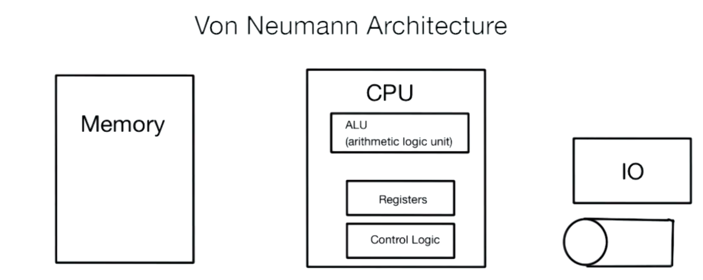

Main resources MongoDB relies on to operate:
- CPU for processing and calculations
- Memory for execution -> IMPORTANT!
- Disk and IO for persistency and communications between servers or within host processes

**Memory**

RAM having come down in price makes prevalence of dbs that are designed around usage of memory. It's also 25x faster than SSD's.

Operations depending heavily on memory include:
- Aggregation
- Index Traversing
- Write Operations
- Query Engine (to retrieve query results)
- Connections (~1MB per established connection)

Generally, the more memory MongoDB has available to it, the better its performance will be.

**CPU**

Used by all applications, database is just one of them. Two main factors of MongoDB associated with CPU:
- Storage Engine
- Concurrency Model

By default, MongoDB will try to use all available cores to respond to incoming requests.

Non locking Storage Engine - WiredTiger - relies heavily on CPU to process requests.

If have non-blocking operations (eg: concurrent writes of documents, or responding to query requests - reads), MongoDB performs better the more CPU resources are available.

Operations requiring availability of CPU cycles:
- Page Compression
- Data Calculation
- Aggrgation Framework Operations
- Map Reduce

### Hardware Considerations and Configurations Part 2

Not all reads and writes are non blocking operations, such as writing constantly to same document (in-place update) requires each write to block all other writes on that document. eg: given a document

```javascript
{
  _id: "FC Porto",
  message: "Best Club in the World!",
  championships: 756
}
```

And the following series of numerous updates:

```javascript
db.clubs.update({_id: 'FC Porto'}, {$inc: {championship : 1}})
db.clubs.update({_id: 'FC Porto'}, {$inc: {championship : 1}})
...
db.clubs.update({_id: 'FC Porto'}, {$inc: {championship : 1}})
```

In above case, multiple cpu's won't help performance because this work cannot be done in parallel, because they all affect the same document.

**IOPS**

MongoDB uses disk to persist data. IOPS: Input/Output operations per second provided by server. The faster this is, the faster mongo can read/write data. Type of disk will greatly affect MongoDB performance.


Disks can be used in different architectures such as RAID for redundancy of read and write operations.

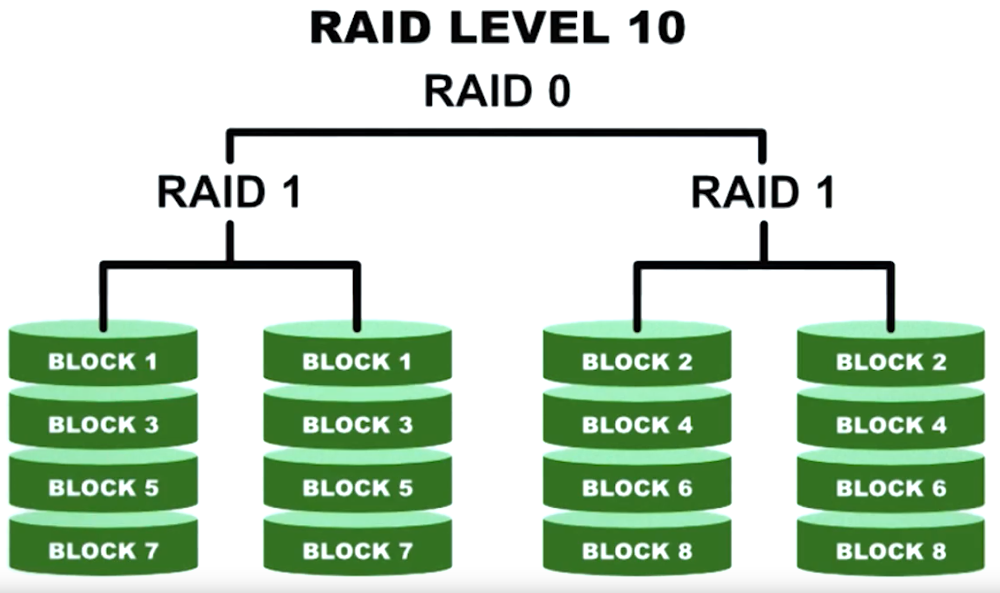

MongoDB benefits from some but not all architectures.

Recommended raid architecture for MongoDB is RAID LEVEL 10. Offers more redundancy and safeguard guarantees with good performance combination.

DO NOT USE RAID 5, RAID 6. Also avoid RAID 0 - has good write performance but limited availability, can lead to reduced performance on read operations.

RAID 10 provides benefits needed by MongoDB:
- Redundancy of segments across physical drives
- Allows extended performance due to parallelization of multiple writes, reads and reads and writes in same disk allocated segments.

Important aspect of MongoDB is the need to write to several different disks. This distributes IO load of different databases, indexes, journaling and lock files -> optimizes performance.

**Network**

MongoDB is a distributed database for high availability, therefore deployment also depends on network hardware. Faster and larger is bandwidth for network -> better performance.


- Applications reach database by establishing connections to host where MongoDB instance is running.
- High availability achieved with replica cluster sets.
- Horizontal scaling achieved with sharding cluster.

The way that different hosts that are holding different nodes of cluster are connected will affect performance. Other considerations include:
- Types of network switches
- Load balancer
- Firewalls
- How far apart cluster nodes are (across different data centers or regions)
- Types of connections between data centers (i.e. latency - can't go faster than speed of light)

Application, while emitting commands can set:
- Write Concern
- Read Concern
- Read Preference

These need to be taken into consideration when analyzing performance of application.

### Lab 1.1: Install Course Dependencies

Attempt course with Docker:

```shell
docker pull mongo:4.0.0
docker run \
  -p 27018:27017 \
  --name course-mongo \
  -v $(pwd)/input:/data/configdb \
  -v course-mongo-data:/data/db \
  -d mongo:4.0.0
docker exec -it course-mongo bash
mongoimport --db m201 --collection people --file /data/configdb/people.json
mongo
show dbs
use m201
db.people.count({ "email" : {"$exists": 1} })
# submit answer
```

Also install [Compass](https://www.mongodb.com/download-center#compass)

## Chapter 2: MongoDB Indexes

### Introduction to Indexes

Indexes trying to solve problem of slow queries.

Example from physical world - book on interior design, trying to find section on bedspreads, could look page by page but that's slow. Faster go to back of book where index is - sorted alphabetically by keywrods with page number. Can quickly find which page the bedspreads section is on.

Translating abvoe example to MongoDB, "Book" -> "Collection".

*Collection Scan:* If not using an index when querying collection, db will have to examine every document. As collection grows in size, will have to search through more documents. This is `O(N)` - linear running time - run time of query is linearly proportional to number of documents `N` in collection.

Index will improve performance:

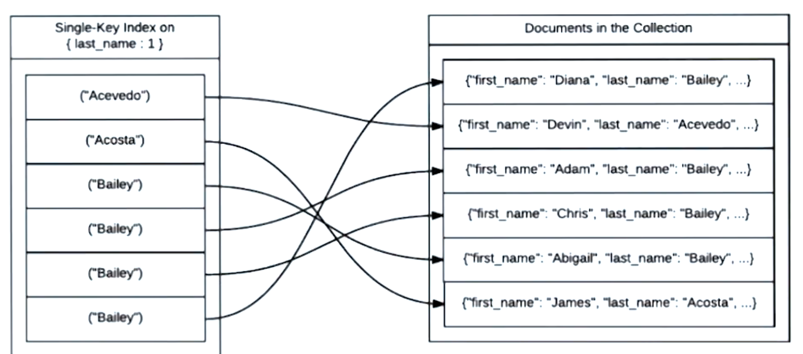

Index limits search space - don't need to search every document, instead, search through ordered index.

Index keeps reference to every document in collection. Index is list of key-value pairs:
- key: value of field that has been indexed on
- value: value of key is reference to document containing the key

Index is associated with one or more fields (last_name in above example).

When creating an index, must specify which fields from documents want to index on.

`_id` field is automatically indexed.

If a query isn't searching by `_id`, then the `_id` index won't be used.

Can have many indexes on same collection.

Index keys are stored in order. This means db doesn't need to look at every index entry to find the one being queried on.

Index stored in B-tree, used to find target values with few comparisons:

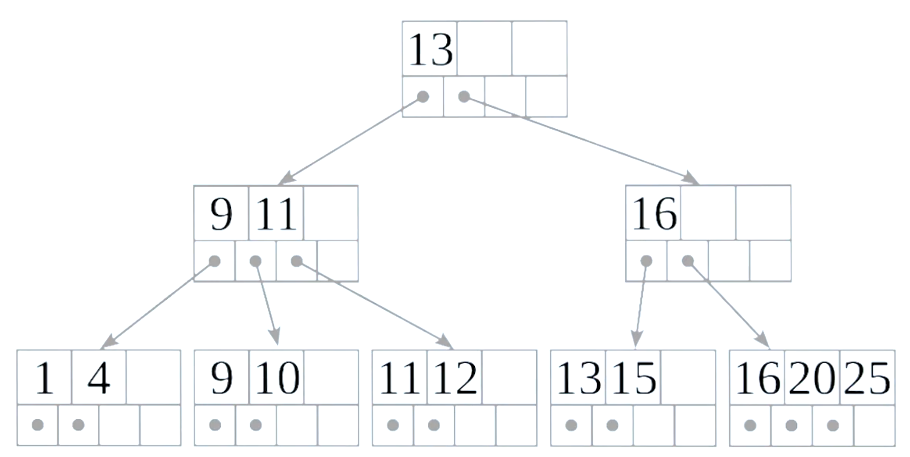

When new documents are inserted, each new insertion doesn't necessarily imply another comparison.

In above example, if searching for value `15`, search wouldn't change if `5` gets inserted.

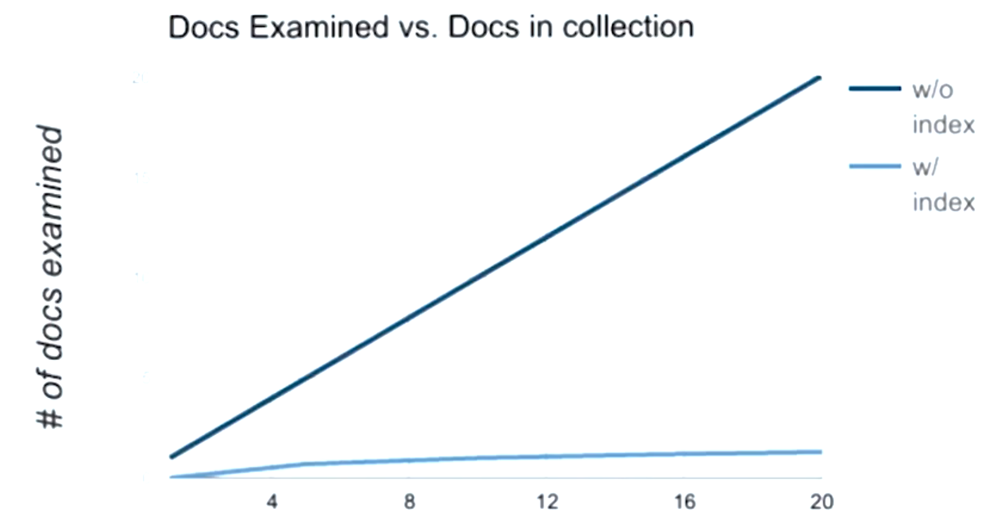

**Index Overhead**

Performance gain of using index has a cost - each additional index decreases write speed on collection. Every time new document insrted in collection, all the collection's indexes need to be updated.

Also if document is updated or removed, some of the indexes (aka b-trees) may need to be rebalanced.

Be careful when creating indexes - don't create unnecessarily because will affect insert/update/delete performance on that collection.

### How Data is Stored on Disk

Databases persist data using the server's file system.


The way mongo stores data on disk differs depending on storage engine supported by MongoDB. Particular details of how each storage engine works are out of scope of this course. But high level review of how each organizes data.

MongoDB supports creating several different data management objects:

```javascript
db.collection.insert({_id: 1})
```


**Database**


- Databases are logical groups of collections.
- Collections are operational units that group documents together.
- Indexes on collections over fields present in documents.
- Documents - atomic units of information used by applications.

**dbpath dir**

Looking at contents of `dbpath` directory, for example, can specify path at mongod startup (this one is default):

```shell
mongod --dbpath /ata/db --fork --logpath /data/db/mongodb.log # start
mongo admin --eval 'db.shutdownServer()'                      # stop
```

Or using Docker:

```shell
docker start course-mongo
docker exec -it course-mongo bash
cd /data/db
ls -l
```

Files:

```
WiredTiger                           diagnostic.data
WiredTiger.lock                      index-1-5808622382818253038.wt
WiredTiger.turtle                    index-3-5808622382818253038.wt
WiredTiger.wt                        index-5-5808622382818253038.wt
WiredTigerLAS.wt                     index-6-5808622382818253038.wt
_mdb_catalog.wt                      index-8-5808622382818253038.wt
collection-0-5808622382818253038.wt  journal
collection-2-5808622382818253038.wt  mongod.lock
collection-4-5808622382818253038.wt  sizeStorer.wt
collection-7-5808622382818253038.wt  storage.bson
```

For each collection and index, WiredTiger storage engine writes an individual `.wt` file.

Catalog file contains catalog of all collections and indexes that mongod contains.


Above is simple flat file organization. Can also have more elaborate structure. Startup mongo with `directoryperdb` instruction:

```shell
docker run \
  -p 27019:27017 \
  --name experiment-mongo \
  -d mongo:4.0.0 --directoryperdb
docker exec -it experiment-mongo bash
mongo hello --eval 'db.a.insert({a:1}, {writeConcern: {w: 1, j:true}})' # write a doc to new db `hello`, collection `a`
ls /data/db
```

This time directory listing is organized differently:

```
WiredTiger       WiredTiger.turtle  WiredTigerLAS.wt  admin   diagnostic.data  journal  mongod.lock    storage.bson
WiredTiger.lock  WiredTiger.wt      _mdb_catalog.wt   config  hello            local    sizeStorer.wt
```

Note 3 new folders due to having specified `directoryperdb` at startup, creates one folder per database:
- admin: default database created by MongoDB
- local: default database created by MongoDB
- hello: newly created database from our insert instruction

Looking inside folder of newly created db:

```shell
ls /data/db/hello
collection-7-1343607420274581578.wt  index-8-1343607420274581578.wt
```

Contains one collection file and one index file (always get _id index).

With WiredTiger storage engine, can go a little further with disk organization. Remove previous container and start again but with `wiredTigerDirectoryForIndexes` instruction:

```shell
docker stop experiment-mongo
docker rm -f experiment-mongo
docker run \
  -p 27019:27017 \
  --name experiment-mongo \
  -d mongo:4.0.0 --directoryperdb --wiredTigerDirectoryForIndexes
docker exec -it experiment-mongo bash
mongo hello --eval 'db.a.insert({a:1}, {writeConcern: {w: 1, j:true}})'
ls /data/db # still get one directory per db
ls /data/db/hello # collection index
```

This time have a directory `collection` and directory `index`:

```shell
ls /data/db/hello/collection/
7--6924425517033069288.wt
ls /data/db/hello/index/
8--6924425517033069288.wt
```

**What does this have to do with performance?**


If have several different disks on server, organizing data as above allows great degree of IO parallelization.

Mongo creates symbolic links to mount points on differnet physical drives.

Every read and write to mongo will use two data structures - collections and indexes. Parallelization of IO improves overall throughput of persistency layer.

**Compression**

Mongo also offers compression for storing data on disk - instruct storage engine to store data on disk using compression algorithm.


Compression improves performance by making each IO operation smaller, which will be faster, but cost more CPU cycles.

Before writing data to disk, data is allocated in memory:


All data in memory is eventually written to disk. This process triggerred by:
- User/application specifies a particular write concern or forcing a sync operation, eg: `db.collection.insert({...}, {writeConcern: {w:3}})`
- Checkpoint: periodic internal process that regulates how data should be flushed/synced into the data file (defined by sync periods).

**Journaling**

Essential component of persistence. Journal file acts as safeguard against data corruption caused by incopmlete file writes. eg: if system sufferes unexpected shutdown, data stored in journal is used to recover to a consistent and correct state.

```shell
ls /data/db/journal
WiredTigerLog.0000000001      WiredTigerPreplog.0000000002
WiredTigerPreplog.0000000001
```

Journal file structure includes individual write operations. To minimize performance impact of journalling, flushes performed with group commits in compressed format. Writes to journal are atomic to ensure consistency of journal files.

App con force data to be synced to journal before acknowledging a write:

```javascript
db.collection.insert({...}, {writeConcern: {w: 1, j: true}})
```

Setting `j: true` will impact performance because mongo will wait until sync is done to disk before confirming the write has been acknowledged.

### Single Field Indexes Part 1

Simplest index, foundation for later more complex indexes. Index that captures keys on a single field.

```javascript
db.<collection>.createIndex({ <field>: <direction> })
```

**Features**

- Keys from only one field
- Can find a single value for the indexed field
- Can find a range of values
- Can use dot notation to index fields in subdocuments
- Can be used to find several distinct values in a single query

Use container where `people.json` was loaded earlier and open mongo shell:

```shell
docker exec -it course-mongo bash
mongo
```

Find a particular person by ssn, appending `explain` function to get more information about query execution:

```javascript
use m201
db.people.find({"ssn": "720-38-5636"}).explain("executionStats")
```

Output:

```
{
	"queryPlanner" : {
		"plannerVersion" : 1,
		"namespace" : "m201.people",
		"indexFilterSet" : false,
		"parsedQuery" : {
			"ssn" : {
				"$eq" : "720-38-5636"
			}
		},
		"winningPlan" : {
			"stage" : "COLLSCAN",
			"filter" : {
				"ssn" : {
					"$eq" : "720-38-5636"
				}
			},
			"direction" : "forward"
		},
		"rejectedPlans" : [ ]
	},
	"executionStats" : {
		"executionSuccess" : true,
		"nReturned" : 1,
		"executionTimeMillis" : 59,
		"totalKeysExamined" : 0,
		"totalDocsExamined" : 50474,
		"executionStages" : {
			"stage" : "COLLSCAN",
			"filter" : {
				"ssn" : {
					"$eq" : "720-38-5636"
				}
			},
			"nReturned" : 1,
			"executionTimeMillisEstimate" : 40,
			"works" : 50476,
			"advanced" : 1,
			"needTime" : 50474,
			"needYield" : 0,
			"saveState" : 394,
			"restoreState" : 394,
			"isEOF" : 1,
			"invalidates" : 0,
			"direction" : "forward",
			"docsExamined" : 50474
		}
	},
	"serverInfo" : {
		"host" : "4efd23485cb9",
		"port" : 27017,
		"version" : "4.0.0",
		"gitVersion" : "3b07af3d4f471ae89e8186d33bbb1d5259597d51"
	},
	"ok" : 1
}
```

Later in course, will go over output in more detail. For now, just care about a few fields:

- `queryPlanner` indicates collection scanning will be used `COLLSCAN` - looking at EVERY document in collection.
- `executionStats` indicates had to examine `50474` documents, which is number of documents in collection.
- `executionStats` also indicates only `1` document returned.
- `totalKeysExamined: 0` - looked at 0 index keys, i.e. no index used because we haven't created any yet.

Bad ratio, inefficient query: 1 doc returned / 50474 examined.

Create an index from mongo shell, on people collection, ssn field, 1 for ascending:

```javascript
db.people.createIndex({ssn: 1})
```

Running above command makes MongoDB build the index. To do so, it must look at every doc in collection, pulling out `ssn` field. If ssn field not present on a doc, key entry will have null value.

Run query again with explain:

```javascript
exp = db.people.explain("executionStats")  // create explainable object
exp.find({"ssn": "720-38-5636"}) // run find on explain object
```

Output:

```
{
	"queryPlanner" : {
		"plannerVersion" : 1,
		"namespace" : "m201.people",
		"indexFilterSet" : false,
		"parsedQuery" : {
			"ssn" : {
				"$eq" : "720-38-5636"
			}
		},
		"winningPlan" : {
			"stage" : "FETCH",
			"inputStage" : {
				"stage" : "IXSCAN",
				"keyPattern" : {
					"ssn" : 1
				},
				"indexName" : "ssn_1",
				"isMultiKey" : false,
				"multiKeyPaths" : {
					"ssn" : [ ]
				},
				"isUnique" : false,
				"isSparse" : false,
				"isPartial" : false,
				"indexVersion" : 2,
				"direction" : "forward",
				"indexBounds" : {
					"ssn" : [
						"[\"720-38-5636\", \"720-38-5636\"]"
					]
				}
			}
		},
		"rejectedPlans" : [ ]
	},
	"executionStats" : {
		"executionSuccess" : true,
		"nReturned" : 1,
		"executionTimeMillis" : 0,
		"totalKeysExamined" : 1,
		"totalDocsExamined" : 1,
		"executionStages" : {
			"stage" : "FETCH",
			"nReturned" : 1,
			"executionTimeMillisEstimate" : 0,
			"works" : 2,
			"advanced" : 1,
			"needTime" : 0,
			"needYield" : 0,
			"saveState" : 0,
			"restoreState" : 0,
			"isEOF" : 1,
			"invalidates" : 0,
			"docsExamined" : 1,
			"alreadyHasObj" : 0,
			"inputStage" : {
				"stage" : "IXSCAN",
				"nReturned" : 1,
				"executionTimeMillisEstimate" : 0,
				"works" : 2,
				"advanced" : 1,
				"needTime" : 0,
				"needYield" : 0,
				"saveState" : 0,
				"restoreState" : 0,
				"isEOF" : 1,
				"invalidates" : 0,
				"keyPattern" : {
					"ssn" : 1
				},
				"indexName" : "ssn_1",
				"isMultiKey" : false,
				"multiKeyPaths" : {
					"ssn" : [ ]
				},
				"isUnique" : false,
				"isSparse" : false,
				"isPartial" : false,
				"indexVersion" : 2,
				"direction" : "forward",
				"indexBounds" : {
					"ssn" : [
						"[\"720-38-5636\", \"720-38-5636\"]"
					]
				},
				"keysExamined" : 1,
				"seeks" : 1,
				"dupsTested" : 0,
				"dupsDropped" : 0,
				"seenInvalidated" : 0
			}
		}
	},
	"serverInfo" : {
		"host" : "4efd23485cb9",
		"port" : 27017,
		"version" : "4.0.0",
		"gitVersion" : "3b07af3d4f471ae89e8186d33bbb1d5259597d51"
	},
	"ok" : 1
}
```

This time, query is more efficient:
- `winningPlan` is index scan `IXSCAN`.
- `executionStatus` has one doc returned as before: `nReturned: 1`
- but only had to look at one doc: `totalDocsExamined: 1`
- index keys were used: `totalKeysExamined: 1`

If query predicate doesn't use a field that is indexed, then will still have collection scan:

```javascript
exp.find({last_name: "Acevedo"})
```

In this case had to examine all 50K docs to return the 10 that match query predicate.

**Dot Notation**

MongoDB allows dot notation to query inside subdocument. Can also use dot notation when specifying indexes.

Example, insert a docs with subdocs into examples collection:

```javascript
db.examples.insertOne({_id: 0, subdoc: {indexedField: "value", otherField: "value"}})
db.examples.insertOne({_id: 1, subdoc: {indexedField: "wrongValue", otherField: "value"}})
```

Specify index on subdoc using dot notation, then use it in a query and verify index is being used.

```javascript
db.examples.createIndex({"subdoc.indexedField": 1})
db.examples.explain("executionStats").find({"subdoc.indexedField": "value"})
```

NEVER index on field that points to a subdocument, `subdoc` field in above example, would have to query on entire subdocument to make use of index.

### Single Field Indexes Part 2

**Range**

```javascript
exp.find({ssn: {$gte: "555-00-0000", $lt: "556-00-0000"}})
```

Since ssn is indexed, index will be used for this query. Only had to examine 49 docs to return 49 docs:

```javascript
"executionStats" : {
  "executionSuccess" : true,
  "nReturned" : 49,
  "executionTimeMillis" : 0,
  "totalKeysExamined" : 49,
  "totalDocsExamined" : 49,
  ...
```

**Set**

```javascript
exp.find({"ssn": {$in: ["001-29-9184", "177-45-0950", "265-67-9973"]}})
```

Index is still used. Only had to examine 3 docs to find the 3 docs matching this query:

```javascript
"executionStats" : {
  "executionSuccess" : true,
  "nReturned" : 3,
  "executionTimeMillis" : 0,
  "totalKeysExamined" : 6,
  "totalDocsExamined" : 3,
```

Note 6 index keys examined, might have expected 3. Due to search algorithm overshooting values being searched for.

Can also specify multiple fields in query, index will still be used even if not all fields are indexed:

```javascript
exp.find({"ssn": {$in: ["001-29-9184", "177-45-0950", "265-67-9973"]}, last_name: {$gte: "H"}})
```

`winningPlan` shows index scan is used to filter down documents matching `ssn`. Then from those results (3 docs), they are further filtered by `last_name` predicate.

```javascript
"winningPlan" : {
  "stage" : "FETCH",
  "filter" : {
    "last_name" : {
      "$gte" : "H"
    }
  },
  "inputStage" : {
    "stage" : "IXSCAN",
    "keyPattern" : {
      "ssn" : 1
    },
```

If query is querying by 2 or more fields where only one of those fields is indexed on (i.e. single key index), db will filter using index, and then look only at filtered docs to `FETCH` the ones that match the other predicates.
Compound indexes can make this even more efficient (later in course).

### Sorting with Indexes

Indexes can also be used to sort documents in query. Any query can also be sorted:

```javascript
db.people.find({first_name: "James"}).sort({first_name: 1})
```

#### Methods for sorting

Any query can be sorted:

```javascript
db.people.find({firsr_name: "James"}).sort({first_name: 1})
```

#### In-Memory Sorting

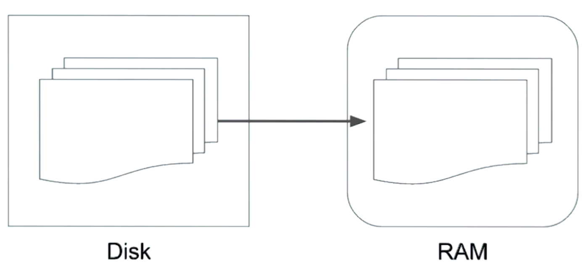

- Documents are stored on disk in unknown order.
- When queried, docs returned in whatever order server finds them, which is rarely what application wants.
- To have docs sorted in particular order, server must read docs from disk into RAM, then perform sorting algorithm on docs in RAM.
- With large number of docs, may be very slow.
- Sorting large mumber of docs in memory is expensive operation -> server will abort in-memory sorting when 32MB of memory have been used.

#### Index Sorting

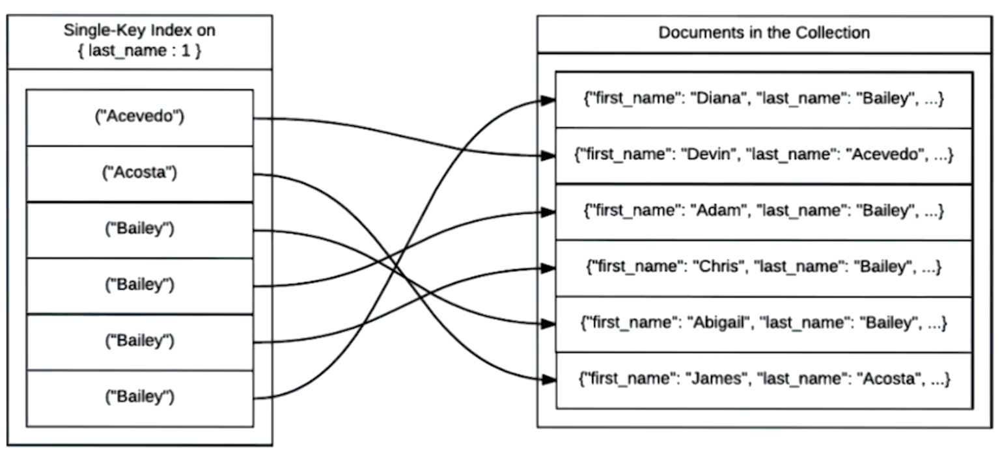

- Keys are ordered according to field specified at index creation.
- Server can take advantage for sorting, if query is using index scan, order of docs returned is guaranteed to be sorted by the index keys -> i.e. no need to perform explicit sort as docs will be fetched from server in sorted order.
- Note docs will only be ordered by fields that make up the index. eg: if index is on last_name ascending, docs will be ordered according to last_name ascending.
- Query planner will use indexes that can be helpful in fulfilling query predicate OR query sort.

Example, find docs sorted by social security number:

```javascript
db.people.find({}, {_id: 0, last_nane: 1, first_name: 1, ssn: 1}).sort({ssn: 1})
```

Returns first 20 docs from `people` collection, sorted by ssn.

Create explainable object:

```javascript
var exp = db.people.explain('executionStats')
exp.find({}, {_id: 0, last_nane: 1, first_name: 1, ssn: 1}).sort({ssn: 1})
```

Execution stats shows had to look at ~50K docs to return ~50k docs, notice also ~50K index keys examained:

```
"executionStats" : {
	"nReturned" : 50474,
	"totalKeysExamined" : 50474,
	"totalDocsExamined" : 50474,
	...
```

But input stage also shows index is used (recall earlier we ran `db.people.createIndex({ssn: 1})`):

```
"inputStage" : {
	"stage" : "FETCH",
	"inputStage" : {
			"stage" : "IXSCAN",
			"keyPattern" : {
				"ssn" : 1
			},
			"indexName" : "ssn_1",
			...
```

In this case index was not used for filtering docs, but for sorting.

If sort by first_name, for which there is no index, note no index keys examed and collection scan used to read all docs into memory, then did in-memory sort.

```javascript
exp.find({}, {_id: 0, last_nane: 1, first_name: 1, ssn: 1}).sort({first_name: 1})
```

```
"executionStats" : {
	"nReturned" : 50474,
	"totalKeysExamined" : 0,
	"totalDocsExamined" : 50474,
	...
```

```
"inputStage" : {
	"stage" : "COLLSCAN",
	...
```

Now try sorting by `ssn` field (recall it has index) but descending:

```javascript
exp.find({}, {_id: 0, last_nane: 1, first_name: 1, ssn: 1}).sort({ssn: -1})
```

Will still use the index to sort, will walk index backwards instead of forwards:

```
"inputStage" : {
	"stage" : "IXSCAN",
	"nReturned" : 50474,
	"direction" : "backward",
	...
```

When sorting with single field index, can always sort docs ascending or descending, regardless of physical order of index keys.

Can also filter and sort by indexed key, eg: find all people who's ssn starts with `555`, then sort by ssn desc:

```javascript
exp.find({ssn: /^555/}, {_id: 0, last_name: 1, first_name: 1, ssn: 1}).sort({ssn: -1})
```

In this case, index scan used for filtering AND sorting docs. Only had to look at 49 docs:

```
"executionStats" : {
	"nReturned" : 49,
	"totalKeysExamined" : 51,
	"totalDocsExamined" : 49,
	...
```

Repeat experiment with descending index keys:

```javascript
db.people.dropIndexes()
db.people.createIndex({ssn: -1})
```

Now execute same query to search for ssn starting with 555 and sort descending

```javascript
exp.find({ssn: /^555/}, {_id: 0, last_name: 1, first_name: 1, ssn: 1}).sort({ssn: -1})
```

Now index walked forwards because index is descending and query sorts descending:

```javascript
"inputStage" : {
	"stage" : "IXSCAN",
	"keyPattern" : {
		"ssn" : -1
	},
	"indexName" : "ssn_-1",
	"direction" : "forward",
	...
```

Concept of forwards/backwards index walking will be discussed later in topic on compound indexes.

### Lecture Querying on Compound Indexes Part 1

Index on two or more fields, supports queries on those fields.

Structure of compound index, recall index is B-tree, which has order. Order is flat. Therefore compound index is one dimensional.


Index keys === ordered list.

Even though there are two fields, index is one dimensional.

Eg: To find person doc for `Adam Bailey`, would check one index key for last_name: Bailey and first_name: Bailey, and that index key points to matching doc.

Even though there are two fields in index, only checking one thing.

**Real-world analogy**

Phone book has index - ordered keys by last name ascending, first name ascending. eg: To find `Chris Bailey`, go to `Bailey` section of phone book, then go down through the `Bailey`'s until find `Chris`.

To find all people with last name `Bailey`'s -> easy because all grouped together in index. But to find all people with first name `James` -> difficult, have to go through every index entry (key) or every single document.

Fields that are defined first in a compound index are more useful than fields that come later.

**Compass Exercise**

Connect to localhost:27019, select `m201`, then `people`, then `Explain Plan`. Enter query:

```javascript
{ "last_name": "Frazier", "first_name": "Jasmine" }
```


Visual explain shows docs examined, docs returned, how long, whether index keys used (0 in this case).

Use Indexes tab of Compass UI to create ascending index on last_name:

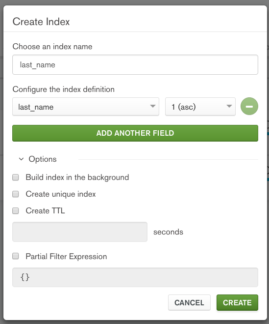

Then run Explain Plan again on same query as before:

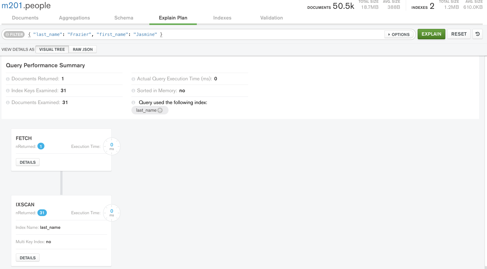

This time only 31 documents had to be examined to find 1 document, much better ratio than before. Query time much faster. Shows `last_name` index being used. 31 index keys examined - all index keys matched last_name `Frazier` but of those 31, only one matched first_name `Jasmine`.

Visual tree shows 2 nodes of execution:
- IXSCAN to find 31 docs matching last_name: Frazier
- FETCH to find the 1 matching first_name: Jasmine

Now create compound index to further improve performance - ORDER OF FIELDS MATTERS:

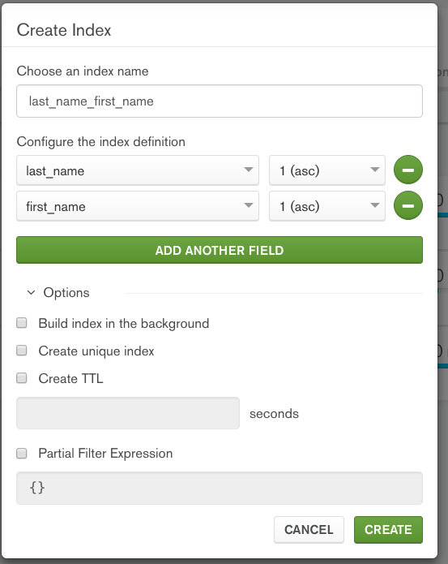

Run explain again - this time note compound index is used, and IXSCAN node returns just 1 doc instead of 31:

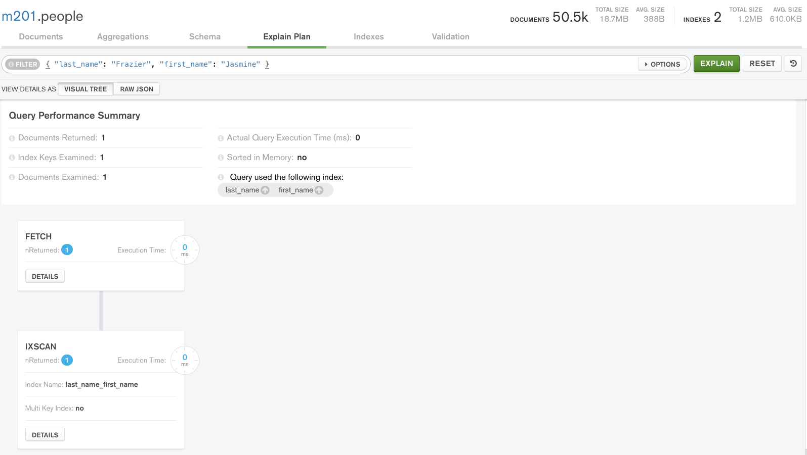

So only 1 document examined to return 1 document - optimal ratio, best performance.

Compound indexes can also be used to find range of values:


This time examined 16 docs, 16 index keys, to return 16 docs -> still optimal ratio 16/16 = 1.

Reason we didn't have to examine any extra docs is because first_name field is also ordered in compound index.

### Querying on Compound Indexes Part 2

**Index Prefixes**

Continuous subset of compound index that starts on the left. Eg, compound index:

```javascript
{"item": 1, "location": 1, "stock": 1}
```

Index prefixes for above are:

```javascript
{"item": 1}
{"item": 1, "location": 1}
```

location,stock, or just stock are NOT prefixes because not continuous starting from left.

Given existence of compound index, Mongo can use any of its index prefixes, just like regular index. Query planner will ignore unused parts of index to the right that are not needed for query.

Consider simple example of last_name, first_name compound index:

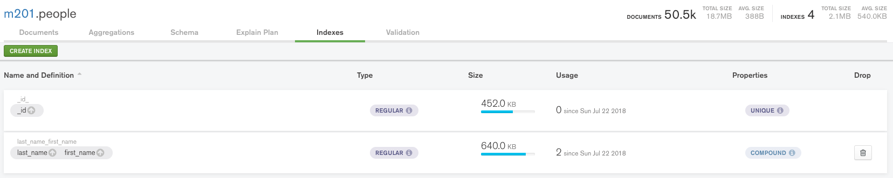

Index prefix is {last_name: 1}. So a query searching by last name will use it:

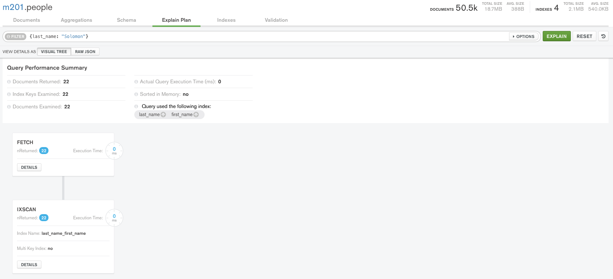

Examined 22 docs to return 22. Shows compound index used but really it was the prefix.

Now try query on first_name:

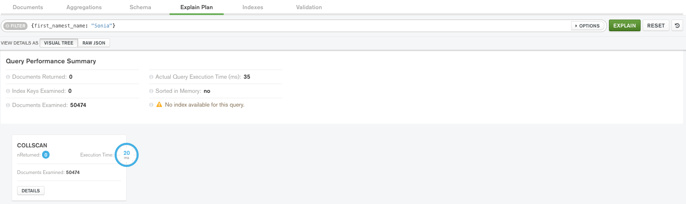

No index used, had to examine all 50K docs to return 8 docs. Was not able to use index because no first_name index prefix exists for the compound index last_name, first_name.

Last names are ordered in index, first names also have an ordering, but only *relative* to last name.

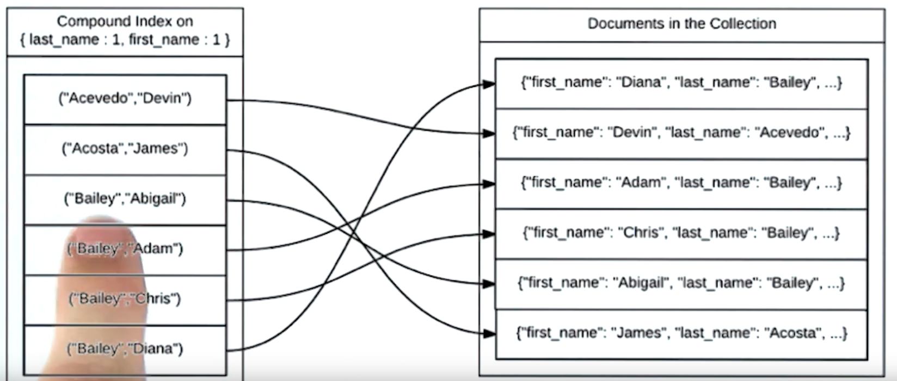

**Performance Advice**

*If application has two queries, and one uses fields that are subset of the other, build an index where one query uses index prefix and other query uses all fields of (compound) index.*

i.e. do not build two separate indexes when one will suffice.

Better example - compound index on multiple fields:

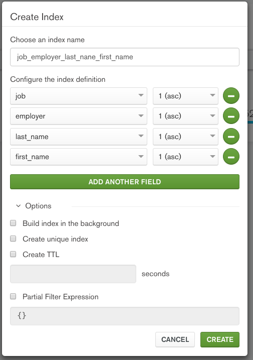

Query on job abd employer - will use index prefix of compound index:

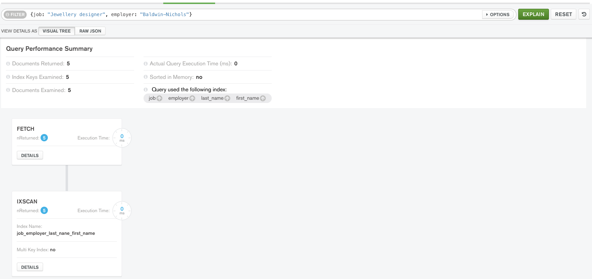

Index prefix will also be used if add last_name to query because that follows order from left of compound index.

Adding first_name to search, will still use index prefix, but have to examine more keys (6) than docs returned (1). Had to scan through all docs matching on job and employer (6) to find the one that has fist_name: Sara: i.e. only could use two of the 4 fields in compound index.

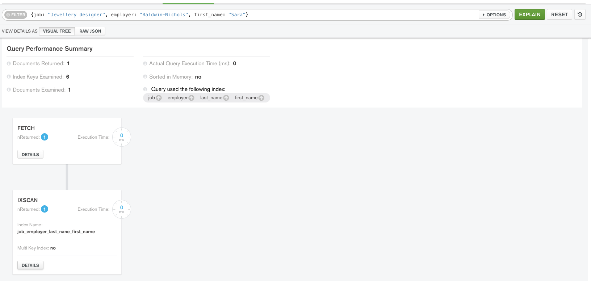

Querying by job, first_name, last_name - will have to examine a lot more index keys - 74, because there are 74 job = Jewellery designer and last_name = Cook.

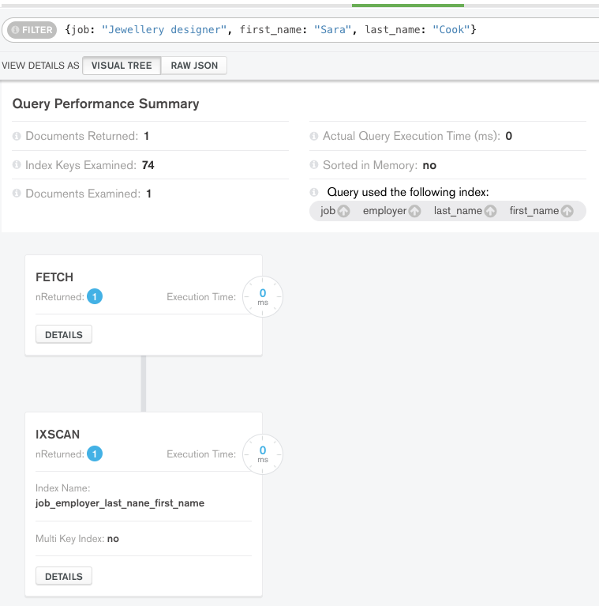

### When you can sort with indexes

Carrying on with people dataset and 4 key compound index (job, employer, last_name, first_name) from previous lecture.

Compound indexes can be used to sort. Simplest is to use index key pattern as sort predictate, in example below, index is used for sorting:

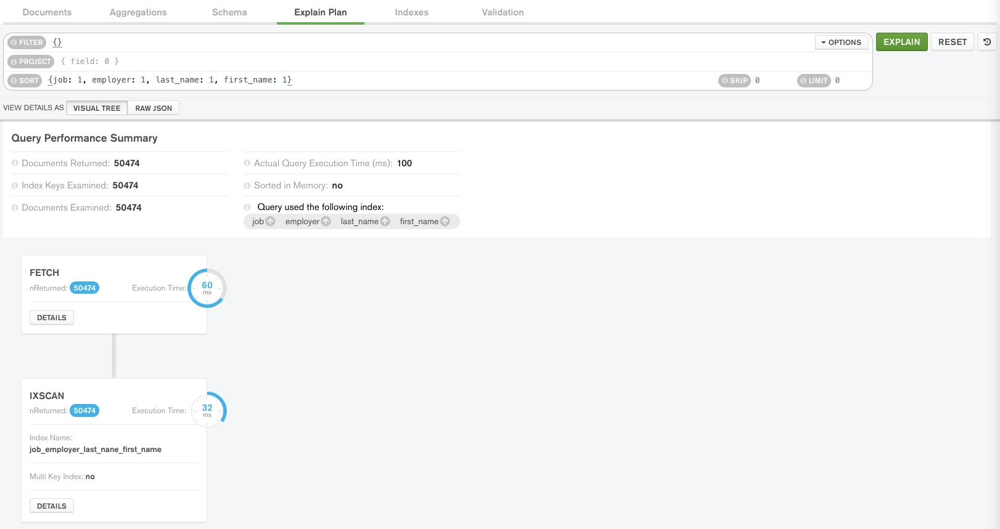

But don't need to use all index keys to take advantage of compound index in sorting, eg: sort by job and employer, will still use compound index via index prefix to prevent in-memory sorting:

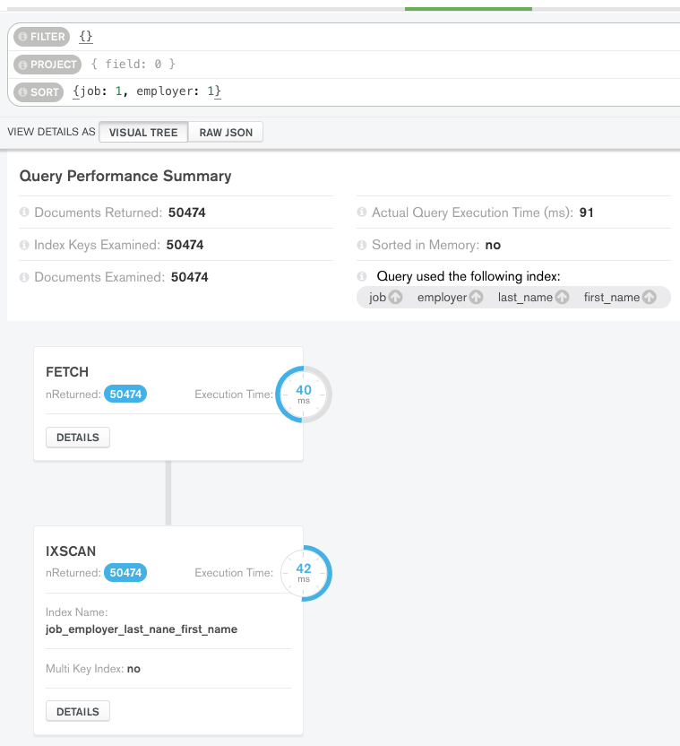

What if sort by employer first and then job? (recall compound index is on: job, employer, last_name, first_name) - this time will do collection scanning and in-memory sorting, because Mongo is unable to use an index prefix in this case:

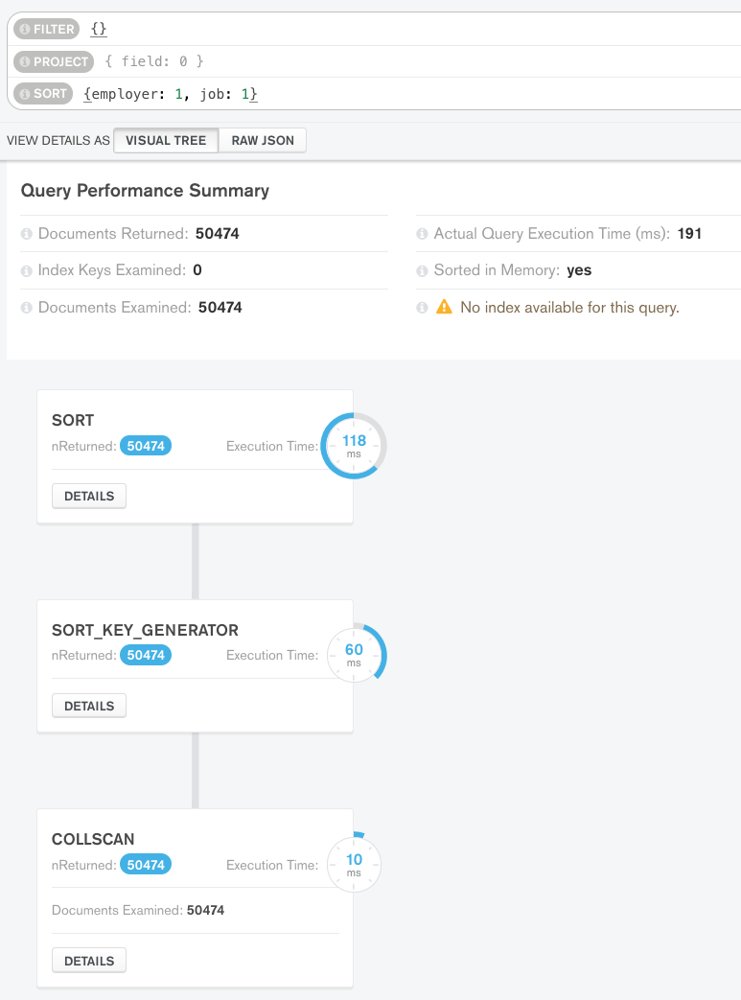

Index will still be used for sorting, regardless of query predicate (eg: if query on email field even though there is no index on email), because server will try to avoid in-memory sorting. Eg - this willuse index:

```javascript
exp.find({email: "jenniferfreeman@hotmail.com"}).sort({job: 1})
```

In this case all 50K docs examined to return 1. Index is used for sorting, not filtering.

Index can be used to both filter and sort docs if includes equality conditions on all prefix keys that precede sort keys. Eg below job, employer are index prefix of compound index and last_name continues that.

```javascript
exp.find({job: "Graphic designer", employer: "Wilson Ltd"}).sort({last_name: 1})
```

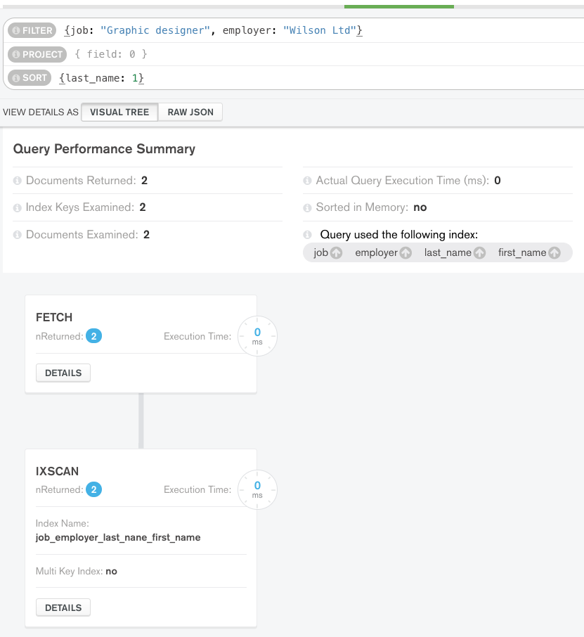

Example below - no longer able to use index for sorting, although it can for fitering:

```javascript
exp.find({job: "Graphic designer"}).sort({last_name: 1})
```

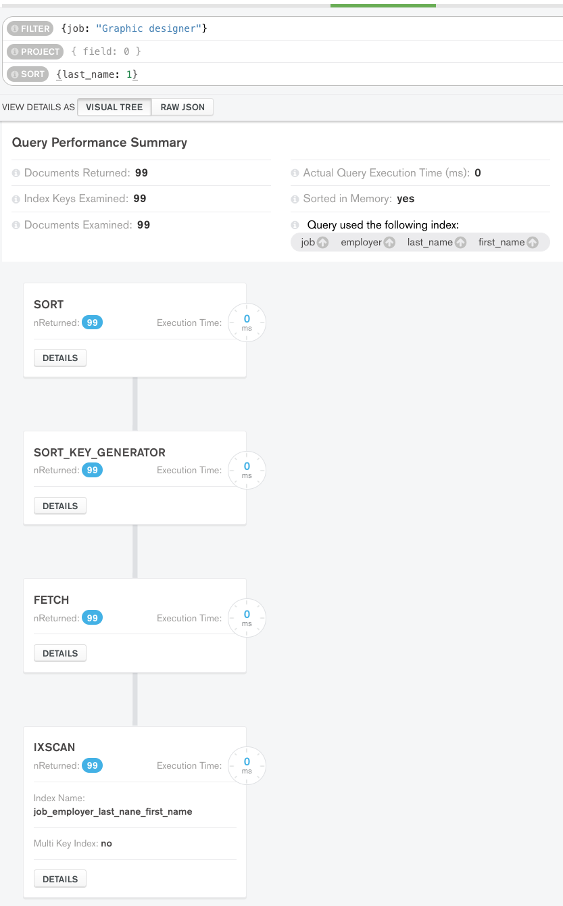

#### Sort Direction with Multiple Fields

Given the following index:

```javascript
db.coll.createIndex({a: 1, b: -1, c: 1})
```

Then this query will walk the index "forwards"

```javascript
db.coll.find({}).sort({a: 1, b: -1, c: 1})
```

To walk index backwards, invert each key:

```javascript
db.coll.find({}).sort({a: -1, b: 1, c: -1})
```

All queries below will use index for sorting:

```javascript
db.coll.find().sort({a: 1})					// walk index forwards - index prefix
db.coll.find().sort({a: 1, b: -1})	// walk index forwards - iindex prefix
db.coll.find().sort({a: -1}) 				// walk index backwards - inverse of index prefix
db.coll.find().sort({a: -1, b: 1})	// walk index backwards - inverse of index prefix
```

Using our compound index example, following would use index because its inverse of prefix {job: 1, employer: 1}:

```javascript
exp.find().sort({job: -1, exployer: -1})
```

But this would do collection scan followed by in-memory sort:

```javascript
exp.find().sort({job: -1, exployer: 1})
```

### Multikey Indexes

Arrays can be embedded in documents:

```javascript
{
	_id: ObjectId("57..."),
	productName: "Long sleeve t shirt",
	categories: ["T-Shirts", "Clothing", "Apparel],
	stock: [
		{size: "S", color: "red", quantity: 25},
		{size: "S", color: "blue", quantity: 10},
		{size: "M", color: "blue", quantity: 50},
	]
}
```

Multikey index is an index on an array field, eg:

```javascript
db.products.createIndex({categories: 1})
```

For each entry in array, server will create separate index key. From eg above, would have 3 index entries all pointing to the same doc: T-Shirts, Clothing,and Apparel.

In addition to indexing on scalar values such as strings, can also index on nested docs, eg:

```javascript
db.products.createIndex({"stock.quantity": 1})
```

Again, server would create 3 index keys, one for each of the sub-docs.

**Limit**

For each index document, can have at most one index field whose value is an array.

With sample doc above, could have index on productName and stock.quantity, but could not have index on categories and stock.quantity, because that would create huge amount of index entries -> cartesian product between number of categories and number of stock entries.

**Performance Advice**

Take care when creating multikey indexes, ensure arrays don't grow too large, this causes index to get overly large, which then may not be able to load entirely in memory, forcing query to go to disk.

Multikey indexes don't support covered queries.

**Exercise**

From mongo shell:

```shell
> use m201
> db.products.insert({
	productName: "MongoDB Short Sleeve T-Shirt",
	categories: ["T-Shirts", "Clothing", "Apparel"],
	stock: {size: "L", color: "green", quantity: 100}
})
> db.products.find().pretty()
{
	"_id" : ObjectId("5b551035246743ab8d457cf6"),
	"productName" : "MongoDB Short Sleeve T-Shirt",
	"categories" : [
		"T-Shirts",
		"Clothing",
		"Apparel"
	],
	"stock" : {
		"size" : "L",
		"color" : "green",
		"quantity" : 100
	}
}
> db.products.createIndex({"stock.quantity": 1})
> var exp = db.products.explain()
> exp.find({"stock.quantity": 100})
```

Index is used, but multikey is false because `stock` is not an array.

```javascript
"winningPlan" : {
	"stage" : "FETCH",
	"inputStage" : {
		"stage" : "IXSCAN",
		"keyPattern" : {
			"stock.quantity" : 1
		},
		"indexName" : "stock.quantity_1",
		"isMultiKey" : false,
```

Now insert a document where `stock` field is an array instead of embedded doc, then run query again:

```shell
> db.products.insert({
		productName: "Long sleeve t shirt",
		categories: ["T-Shirts", "Clothing", "Apparel"],
		stock: [
			{size: "S", color: "red", quantity: 25},
			{size: "S", color: "blue", quantity: 10},
			{size: "M", color: "blue", quantity: 50},
		]
	});
> exp.find({"stock.quantity": 100})
```

Still doing index scan,but this time, multikey is true, because `stock` is an array field in one of the documents.

```javascript
"isMultiKey" : true,
"multiKeyPaths" : {
	"stock.quantity" : [
		"stock"
	]
},
```

### Partial Indexes

May want to index only a portion of documents. Can reduce performance costs of creating and maintaining indexes.

Eg: collection of restaurants:

```javascript
{
	"_id": ObjectId("58a..."),
	"name": "Han Dynasty",
	"cuisine": "Sichuan",
	"stars": 4.4,
	"address": {
		"street": "90 3rd Ave",
		"city": "New York",
		"state: "NY",
		"zipcode": "10003"
	}
}
```

Suppose majority of queries are only for restaurants with > 3.5 stars. Create partial index - only index on city and cuisine if restarant has 3.5 stars are greater:

```javascript
db.restaurants.createIndex(
	{"address.city": 1, cuisine: 1},
	{partialFilterExpression: {"stars": {$gte: 3.5}}}
)
```

This reduces number of index keys mongo needs to store - reduces memory requirement. Useful when index has grown too large to fit into memory.

Partial indexes also useful with multikey indexes.

Sparse indexes are special case of partial indexes. Sparse index only indexes doc where a index field exists in doc, eg:

```javascript
db.restaurants.createIndex(
	{stars: 1},
	{sparse: true}
)
```

Partial index syntax for above would be:

```javascript
db.restaurants.createIndex(
	{stars: 1},
	{partialFilterExpression: {"stars": {$exists: true}}}
)
```

Partial indexes are more expressive than sparse indexes - can define filter expression that checksk for existence of fields that are not index keys, eg:

```javascript
db.restaurants.createIndex(
	{stars: 1},
	{partialFilterExpression: {"cuisine": {$exists: true}}}
)
```

**Exercise**

From mongo shell:

```shell
> use m201
> db.restaurants.insert({
		"name" : "Han Dynasty",
		"cuisine" : "Sichuan",
		"stars" : 4.4,
		"address" : {
			"street" : "90 3rd Ave",
			"city" : "New York",
			"state" : "NY",
			"zipcode": "10003"
		}
	});
> db.restaurants.find({'address.city': 'New York', cuisine: 'Sichuan'})
{ "_id" : ObjectId("5b55c4c0b13dbf68f04e12ab"), "name" : "Han Dynasty", "cuisine" : "Sichuan", "stars" : 4.4, "address" : { "street" : "90 3rd Ave", "city" : "New York", "state" : "NY", "zipcode" : "10003" } }
> var exp = db.restaurants.explain()
> exp.find({'address.city': 'New York', cuisine: 'Sichuan'})
COLLSCAN...
> db.restaurants.createIndex(
	{"address.city": 1, cuisine: 1},
	{partialFilterExpression: {"stars": {$gte: 3.5}}}
)
> exp.find({'address.city': 'New York', cuisine: 'Sichuan'})
```

After that last explain, would think partial index would be used but it's not, still doing COLLSCAN.

To use partial index, query must be guaranteed to match subset of docs specified by filter expression. Otherwise server might miss results where matching docs not indexed.

To make index used, need to include predicate that matches partial filter expression, stars in our example:

```shell
> exp.find({'address.city': 'New York', cuisine: 'Sichuan', stars: {$gt: 4.0}})
```

Now, IXSCAN is used.

#### Partial Index Restrictions

- Can't specify both `partialFilterExpression` and `sparse` options
- _id indexes can't be partial (because every doc must have indexed _id field)
- Shard key indexes can't be partial

### Text Indexes

Often store text in docs, eg:

```javascript
{
	_id: ObjectId("57b..."),
	productName: "MongoDB Long Sleeve T-Shirt",
	category: "Clothing"
}
```

Useful to search for docs based on words that are part of text fields.

This query would find the matching doc if you knew *exactly* what string to look for:

```javascript
db.products.find({productName: "MongoDB Long Sleeve T-Shirt"})
```

But users unlikely to know exact string to search for, could use regex - works but bad for performance even with index:

```javascript
db.products.find({productName: /T-Shirt/})
```

Solution is to create a text index - special kind of index:

```javascript
db.products.createIndex({productName: "text"})
```

Now can use full text search, avoids collection scan:

```javascript
db.products.find({$text: {$search: "t-shirt"}})
```

Text indexing similar to multikey index. Mongo processes each text field in document, eg "MongoDB Long Sleeve T-Shirt", creating index key for each unique word in string, eg:

- mongodb
- long
- sleeve
- t
- shirt

Note: unicode considers space and hyphens as text delimiters.

By default, text indexes are case insensitive.

Similar to multikey indexes, be aware that:
- Text indexes may result in creation of many index keys, if documents have large text fields. This means query engine has more keys to examine
- Increase in overall index size.
- Increased time to build index compared to traditional index.
- Decreased write performance compared to tranditional index.

Strategy to minimize text index size is to use compound index, limits number of text keys that need to be examined by limiting on category when searching, eg:

```javascript
db.products.createIndex({category: 1, productName: "text})
db.products.find({
	category: "Clothing",
	$text: {$search: "t-shirt"}
})
```

**Exercise**

From mongo shell, insert a few docs, then create text index:

```shell
> mongo m201
> db.textExample.insertOne({"statement": "MongoDB is the best"})
> db.textExample.insertOne({"statement": "MongoDB is the worst"})
> db.textExample.createIndex({statement: "text"})
> db.textExample.find({$text: {$search: "MongoDB best"}})
```

Text search returns two results:

```shell
{ "_id" : ObjectId("5b55cf70b13dbf68f04e12ac"), "statement" : "MongoDB is the best" }
{ "_id" : ObjectId("5b55cf7fb13dbf68f04e12ad"), "statement" : "MongoDB is the worst" }
```

Why is `worst` showing up in results?

Text queries logically `or` each delimited word. i.e. above example searched for any docs that include `MongoDB` OR `best`.

Project `textScore` to return results. `$text` assigns a `score` to each document based on relevance of that doc to search:

```javascript
> db.textExample.find({$text: {$search: "MongoDB best"}}, {score: {$meta: "textScore"}})
{ "_id" : ObjectId("5b55cf7fb13dbf68f04e12ad"), "statement" : "MongoDB is the worst", "score" : 0.75 }
{ "_id" : ObjectId("5b55cf70b13dbf68f04e12ac"), "statement" : "MongoDB is the best", "score" : 1.5 }
```

Sort by projected score field to guarnatee most relevant results first:

```javascript
> db.textExample.find({$text: {$search: "MongoDB best"}}, {score: {$meta: "textScore"}}).sort({score: {$meta: "textScore"}})
{ "_id" : ObjectId("5b55cf70b13dbf68f04e12ac"), "statement" : "MongoDB is the best", "score" : 1.5 }
{ "_id" : ObjectId("5b55cf7fb13dbf68f04e12ad"), "statement" : "MongoDB is the worst", "score" : 0.75 }
```

### Collations

Specify language specific rules for string comparison, such as letter case and accents. Defined with options:

```javascript
{
	locale: <string>, 		// determines ICU supported locale for collation
	caseLevel: <boolean>, // remainder of options out of scope for this course
	caseFirst: <string>,
	strength: <int>,
	numericOrdering: <boolean>,
	alternate: <string>,
	maxVariable: <string>,
	backwards: <boolean>
}
```

Collations can be defined at different levels:

**Collection creation time**

eg: all queries and indexes against this collection will use collation for `pt` locale:

```javascript
> db.createCollection("foreign_text", {collation: {locale: "pt"}})
> db.foreign_text.insert({ "name": "Máximo", "text": "Bom dia minha gente!"})
> db.foreign_text.find({_id: {$exists: 1}}).explain()
... "collation" : {
	"locale" : "pt",
	...
```

Can specify a different collation on a given request or index creation. For index, will override default and collection level collations.

```javascript
> db.foreign_text.find({ _id: {$exists:1 } }).collation({locale: 'it'})
> db.foreign_text.aggregate([ {$match: { _id: {$exists:1 }  }}], {collation: {locale: 'es'}})
> db.foreign_text.createIndex( {name: 1},  {collation: {locale: 'it'}} )
```

In order for index to be used by a query, query must match collation of index.

```javascript
// uses the collection collation (Portuguese)
db.foreign_text.find( {name: 'Máximo'}).explain()

// uses the index collation (Italian)
db.foreign_text.find( {name: 'Máximo'}).collation({locale: 'it'}).explain()
```

**Collation Properties**

- Needed for correctness of text searching
- Marginal performance impact
- Case insensitive indexes

Set `strength` to 1 for primary level of comparison (i.e. case insensitive index):

```javascript
db.createCollection( "no_sensitivity", {collation: {locale: 'en', strength: 1}})
```

In this case sorting by some text field where docs contain values like `aaa` and/or `AAA`, `aAa` etc, will sort the same ascending or descending.

## Index Operations

### Building Indexes

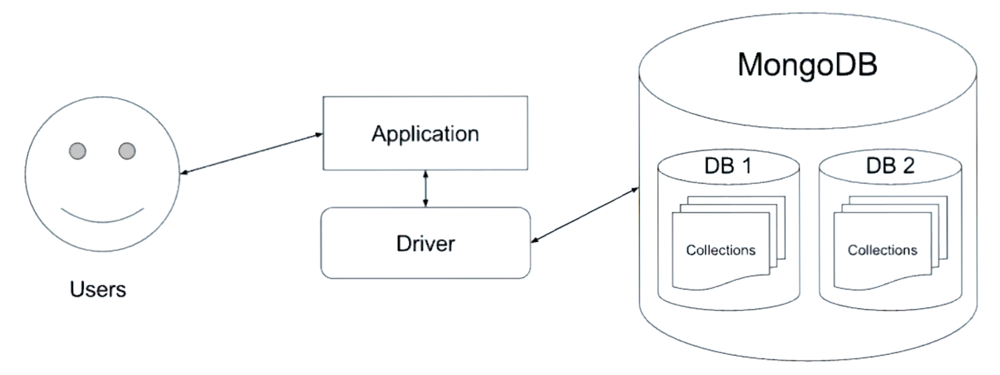

Want minimal impact on app users in prod when creating an index.

Index can be created in foreground or background.

**Foreground**

Very fast but blocks all incoming operations to database containing collection on which index is being built. i.e. this db not available for app reads/writes until index build is complete.

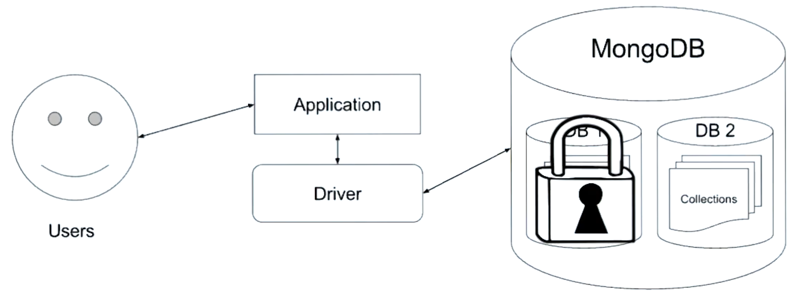

If must do in foreground, then set a maintenance window.

**Background**

Don't block operations but slower to build index. How much slower depends on number of reads/writes going on in the foreground, and whether index will fit entirely in memory.

Still has some impact on query performance while index is being built.

**Exercise**

```shell
$ mongoimport -d m201 -c restaurants --drop /data/configdb/restaurants.json
2018-07-25T18:24:54.756+0000	connected to: localhost
2018-07-25T18:24:54.758+0000	dropping: m201.restaurants
2018-07-25T18:24:57.754+0000	[######..................] m201.restaurants	37.4MB/144MB (26.0%)
2018-07-25T18:25:00.754+0000	[############............] m201.restaurants	75.4MB/144MB (52.5%)
2018-07-25T18:25:03.755+0000	[##################......] m201.restaurants	114MB/144MB (79.0%)
2018-07-25T18:25:06.097+0000	[########################] m201.restaurants	144MB/144MB (100.0%)
2018-07-25T18:25:06.098+0000	imported 1000000 documents
```

Need to build a compound index to support:
- sort by name
- specify particular cuisine
- specify range of zip codes

Given 1M docs in collection, will take considerable amount of time to build index. Exactly how long depends on cardinality of fields and other operations going on at the same time.

Requirements:
- Add new compound index
- Creating index will take some time
- Don't wnat to schedule a maintenance window
- Index will fit in RAM

Create index in background, by default background is set to false so must set it explicitly otherwise:

```shell
$ mongo
> use m201
> db.restaurants.createIndex({"cuisine": 1, "name": 1, "address.zipcode": 1}, {"background": true})
{
	"createdCollectionAutomatically" : false,
	"numIndexesBefore" : 1,
	"numIndexesAfter" : 2,
	"ok" : 1
}
```

Background option can be used on standalone mongod, or primary or secondaries in replica set.

Note even though index is being created in background, shell will block until command returns. To see status, open another shell and check for current operations, passing in a filter to limit results. This looks for commands that are creating indexes or inserting documents into an index:

```shell
> use m201
> db.currentOp(
	{
		$or: [
			{op: "command", "query.createIndexes": {$exists: true}},
			{op: "insert", ns: /\.system\.indexes\b/}
		]
	}
)
```

Notice each operation has an `opid`, will need this if want to kill the operation before it completes, eg:

```shell
> db.killOp(12345)
```

### Query Plans

Eg: when query is requested:

```javascript
db.restaurants.find({
	"address.zipcode": {$gt: '50000'},
	cuisine: 'Sushi'
}).sort({stars: -1})
```

Query plan is formed:

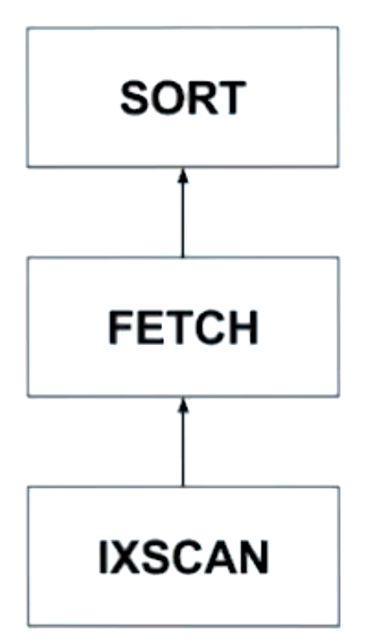

Series of stages that feed into one another. In above example:

If index exists `{"address.zipcode": 1, cuisine: 1}`

1. IXSCAN: Record ids that meet query predicate will be read from index.
2. FETCH: Record id's from IXSCAN passed into FETCH stage, this is where storage engine converts record ids to documents.
3. SORT: Documents passed to SORT stage which will do in-memory sort.

For any given query, could have many different query plans based on available indexes.

If had this index, would prevent in-memory sort: `{cuisine: 1, stars: 1}` because record id's coming out of IXSCAN stage would already be sorted by `stars`.


**How is query plan selected?**

Given query hitting server for first time:

```javascript
db.restaurants.find({
	"address.zipcode": {$gt: '50000'},
	cuisine: 'Sushi'
}).sort({stars: -1})
```

Server looks at all available indexes on collecion.

```javascript
{_id: 1}
{name: 1, cuisine: 1, stars: 1}
{"address.zipcode": 1, cuisine: 1}
{"address.zipcode": 1, stars: 1}
{Cuisine: 1, stars: 1}
```

Then determines of these, which are viable to satisfy query - i.e. *candidate indexes*:

```javascript
{"address.zipcode": 1, cuisine: 1}
{"address.zipcode": 1, stars: 1}
{Cuisine: 1, stars: 1}
```

Then for each candidate index, query optimizer geenrates *candidate plans*.

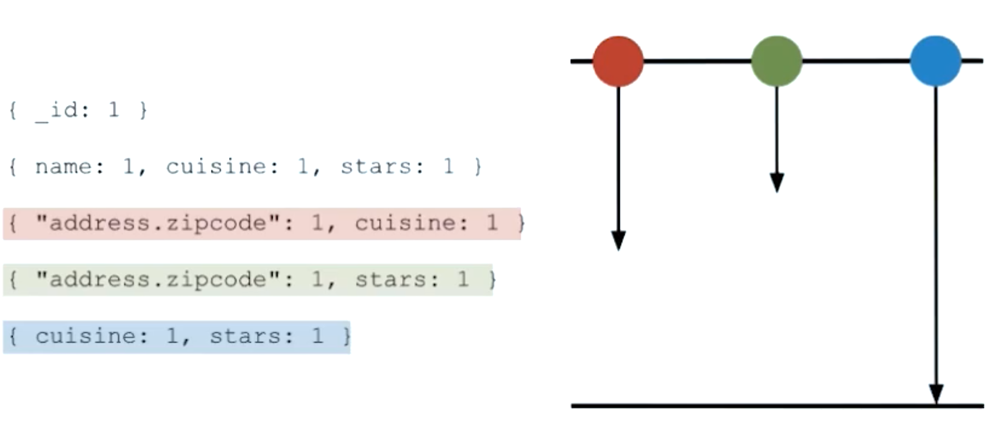

MongoDB has *empirical query planner* - trial period where each candidate plan is executed over short period of time. Planner evaluates which performs the best:

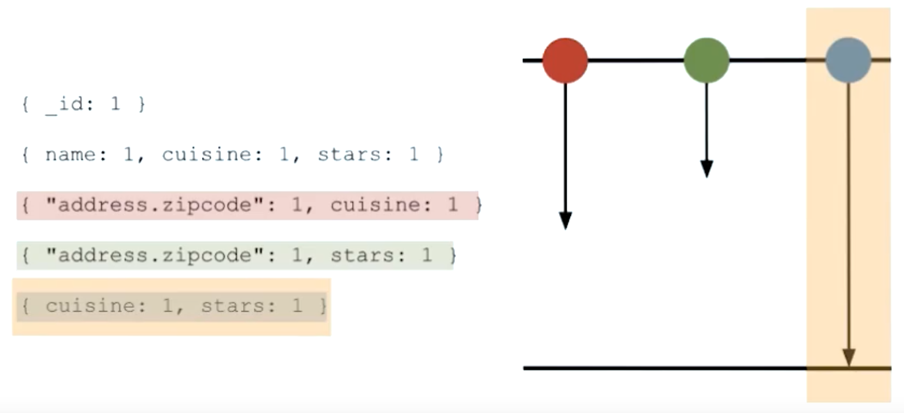

Best could mean:
- which plan returns all results first
- which plan returned certain number of docs in sort order fastest
- other...

When run `explain`, winning plan will show the best plan that was evaluated. Other plans will show up under rejected section.

**Cache**

Not efficient to run trial plans for every incoming query since lots of them have the same "shape".

MongoDB caches which plan should be used for a given query shape.

Over time, collection and indexes may change, therefore plan cache will evict the cache occasionally. Plans can be evicted when:
- Server restarted.
- Amount of work performed by first portion of query exceeds amount of work performed by winning plan by factor of 10.
- Index rebuilt.
- Index created or dropped.

### Understanding Explain Part 1

Explain can answer these questions:
- Is query using expected index?
- Is query using index to sort?
- Is query using index to provide projection?
- How selective is index?
- Which part of plan is most expensive?

To run explain, can append to end of query:

```javascript
db.people.find({"address.city": "Lake Meaganton"}).explain()
```

But recommended way is to create explainable object:

```javascript
exp = db.people.explain()
```

Then use explainable object to run query - more convienient can run multiple queries from same exp object:

```javascript
exp.find({"address.city": "Lake Meaganton"})
exp.find({"address.city": "Lake Brenda"})
```

Shell will return what would happen, without actually executing query.

Default argument (don't need to specify) - WiLL NOT execute query:

```javascript
exp = db.people.explain("queryPlanner")
```

Another argument (must specify) to get stats - WILL execute query:

```javascript
exp = db.people.explain("executionStats")
```

Most verbose - use when want to look at alternate plans that were considered by planner but rejected - WILL execute query:

```javascript
exp = db.people.explain("allPlansExecution")
```

**Exercise**

```shell
mongo
> use m201
> exp = db.people.explain()
> expRun = db.people.explain("executionStats")
> expRunVerbose = db.people.explain("allPlansExecution")
> expRun.find({"last_name":"Johnson", "address.state":"New York"})
# winning plan is COLLSCAN -> bad!
> db.people.createIndex({last_name:1})
# rerun same query
> expRun.find({"last_name":"Johnson", "address.state":"New York"})
# this time winning plan is IXSCAN, followed by FETCH
```

In `executionStatus`, queries that are run most frequently should have:
- `totalDocsExamined` and `nReturned` to be close to same number.
- `totalKeysExamined` and `nRetunred` to be close to same number.

Continuin with exercise, create another index, then re-run same query as before:

```javascript
> db.people.createIndex({"address.state": 1, last_name: 1})
> expRun.find({"last_name":"Johnson", "address.state":"New York"})
```

Now will also see `rejectedPlans` in explain output - showing other plans that were considered. This shows up because we now have multiple indexes for planner to evaluate.

Evaluate sort:

```javascript
var res = db.people.find({"last_name":"Johnson", "address.state":"New York"}).sort({"birthday":1}).explain("executionStats")
res.executionStats.executionStages
```

`inputStage` shows `SORT_KEY_GENERATOR`, which means in-memory sort is being used.

Note also memory usage for in-memory sort:

```javascript
"memUsage" : 2894, 			// ~2.8K
"memLimit" : 33554432,	// 32M
"inputStage" : {
	"stage" : "SORT_KEY_GENERATOR",
	"nReturned" : 7,
```

Notice that memory limit is 23M -> if a sort ever requires more than 32M, then server will cancel the query.

Above query returned 7 docs, determine avg size of doc, multiply. If that result > 32M sort limit, then sort will cancel

### Understanding Explain Part 2

More complex example, running explain on sharded cluster, using `mlaunch` from `mtools` to setup sharded cluster:

```shell
$ mlaunch init --single --sharrded 2
```

Then enable sharding after cluster is running:

```shell
$ mongo
> use m201
> sh.enableSharding("m201")
> sh.shardCollection("m201.people", {_id: 1})
mongos> exit
mongoimport -d m201 -c people people.json
mongo
mongos> use m201
mongos> > db.people.getShardDistribution()
```

Now when query run on mongos, mongos itself doesn't do the work, it sends the query to each shard. Each shard evaluates query, selects plan, then results aggregated on mongos.

```shell
db.people.find({"last_name":"Johnson", "address.state":"New York"}).explain("executionStats")
```

Would expect same plan chosen on each shard. But each shard may choose a different plan, for eg if it has more or less data to process.

Now last stage in plan is `"SHARD_MERGE"`.

### Forcing indexes with hint()

Can force mongo to use a particular index by overriding mongo's default index selection with `hint()`.

eg query:

```javascript
db.people.find({name: "john Doe", zipcode: {$gt: "6300"}})
```

Query optimizer may not always choose index we'd like, eg may use index `{name: 1, age: 1}` instead of `{name: 1, zipcode: 1}`.

To force it to use index you want, append `hint` method to query, passing in "shape" of desired index:

```javascript
db.people.find({name: "john Doe", zipcode: {$gt: "6300"}}).hint({name: 1, zipcode: 1})
```

Can also pass index name to hint:

```javascript
db.people.find({name: "john Doe", zipcode: {$gt: "6300"}}).hint("name_1_zipcode_1)
```

**Use with caution!**

Mongo's query optimizer generally picks the correct index. If it does pick not the best one, probably because there are too many different indexes on collection - better to review why there are so many indexes and consider if some are superfluous and could be removed.

### Resource Allocation for Indexes

Indexes require physical resources.

#### Determine Index Size

Compass will display index size for each collection in a database. Selecting a particular collection will break down index size for each index on that collection.

Can also get this info from shell: `db.stats()`.

#### Resource Allocation

Indexes need two computational resources:

Disk to store index information. Not generally an issue because if not enough space on disk for index, wouldn't get created. After index created, disk space requirement is a function of dadta. Therefore you would run out of disk space for collections before encoutering issues with indexes. However, if operating with separate disks for indexes vs collection, do need to ensure disk allocated for indexes is large enough.

Memory to operate with those data structures. This is most intensive resource utilization for index usage. Deployments should be sized to accomodate all indexes in RAM.

If not enough space in RAM for index, lots of disk access will be required to traverse index.


Different pages from index on disk will be allocated to memory:


As you traverse that space, will slide pages into positions that are no longer in memory, therefore need to allocate those to memory and flush out info to disk:


If constantly traversing index -> lots of page in/out.

To assess, first get server RAM, eg (from Docker container):

```shell
$ free -h
              total        used        free      shared  buff/cache   available
Mem:           2.0G        256M        259M        768K        1.4G        1.5G
Swap:          1.0G          0B        1.0G
```

Shows 2G RAM available.

Can specify WT cache size at mongo startup:

```shell
mongod --dbpath data --wiredTigerCacheSizeGB 1
```

Then even though mem on machine is 2G, amount allocated to Mongo will only be 1G.

**What percentage of index is cached in memory?**

From mongo shell, get collection stats, passing in flag to also include index details:

```javascript
> db.people.stats({indexDetails: true})
```

Returns HUGE amount of data, to deal with it:

```javascript
> var stats = db.people.stats({indexDetails: true})
> stats.indexDetails
```
Returns index details for each index on collection.


Look at `"cache"` entry:

```javascript
"cache" : {
	"bytes currently in the cache" : 3568, 	// how much of index is in RAM
	"bytes read into cache" : 1160,
	...
	"pages read into cache" : 3,						// use to determine hit and pass page ratios
	"pages requested from the cache" : 2,		// use to determine hit and pass page ratios
	...
```

`pages requested from the cache` means queries were run using the index and it was traversed, therefore mongo read pages from RAM.

#### Edge Cases

General rule is to always have enough memory to allocate indexes. Exceptions to this are:

- Occasional reports (eg: BI tools, might need an index to support queries)
- Right-end-side index increments

If a BI report doesn't run very often, don't necessarily need entire index that supports it in memory.

To mitigate this, don't run query against primaries in replica sets and do not create index on primary. Rather, use secondaries.

Another exception is when have indexes on fields that grow monotonically - eg: counters, dates, incremental id's. Recall index is b-tree. Monotonically incrementing fields will cause index to become unbalanced on the right hand side -> grows with new data incoming.


If only need to query on most recent data, then only need most recent right-hand portion in memory, not the whole thing because left side and upper right of it contains older data.

### Basic Benchmarking

**Low Level Benchmarking**

- File I/O performance
- Scheduler performance
- Memory allocation and transfer speed
- Thread performance
- Database server performance
- Transaction isolation

**Database Server Benchmarking**

- Data set load
- Writes per second
- Reads per second
- Balanced workloads
- Read / Write ratio

**Distributed Systems Benchmarking**

Most relevant for Mongo.

- Linearization
- Serialization
- Fault tolerance

Tool: [jepsen.io](http://jepsen.io/)

#### Benchmarking Conditions

Most tooling was built for relational db's, not necessarily relevant to MongoDB.

Specific tool for Mongo [POCDriver](https://github.com/johnlpage/POCDriver) but needs Java and Maven.

Tooling may not capture app-specific use cases.

- Hardware
- Clients
- Load

**Benchmarking Anti-Patterns**

- Database swap replace (comparing mongo to relational using exact same schema)
- Using mongo shell for write and read requests (not reflective of typical app usage)
- Using mongoimport to test write response
- Local laptop to run tests (use a server)
- Using default MongoDB parameters (use production settings - eg authentication, high availability)

## Chapter 4: CRUD Optimization

### Optimizing CRUD Operations

**Exercise**

```javascript
var exp = db.restaurants.explain("executionStats")
exp.find({ "address.zipcode": { $gt: '50000' }, cuisine: 'Sushi' }).sort({ stars: -1 })
```

As expected with no index, `totalDocsExamined: 1000000`, `nReturned: 11611`.

Now create a naive index and explain:

```javascript
db.restaurants.createIndex({"address.zipcode": 1,"cuisine": 1,"stars": 1})
exp.find({ "address.zipcode": { $gt: '50000' }, cuisine: 'Sushi' }).sort({ stars: -1 })
```

Uses index, but not very selective (i.e. looking at many unnecessary index keys) and still doing in-memory sort.

```javascript
{
	nReturned: 11611,
	totalKeysExamined: 95988,
	totalDocsExamined: 11611,
}
```

Examining 80K more index keys than needed because first index key is `address.zipcode`, but query on zipcode doing range, which isn't very selective, as compared to equality condition.

```javascript
// see how many documents match 50000 for zipcode (10)
db.restaurants.find({ "address.zipcode": '50000' }).count()

// see how many documents match our range (about half)
db.restaurants.find({ "address.zipcode": { $gt: '50000' } }).count()
```

Cuisine is more selective:

```javascript
// see how many documents match an equality condition on cuisine (~2%)
db.restaurants.find({ cuisine: 'Sushi' }).count()
```

Knowing selective portiosn of query, re-order index to take advantage of that and re-run query:

```javascript
db.restaurants.createIndex({ "cuisine": 1, "address.zipcode": 1, "stars": 1 })
exp.find({ "address.zipcode": { $gt: '50000' }, cuisine: 'Sushi' }).sort({ stars: -1 })
```

Notice way less index keys examined:

```javascript
"executionStats" : {
	"nReturned" : 11611,
	"totalKeysExamined" : 11611,
	"totalDocsExamined" : 11611,
```

But still doing in-memory sort, even though index includes `stars` key. Recall can only use an index for both filtering and sorting if the keys in the query predicate are in an equality condition. Since `zipcode` is used in a range query, not able to use the existing index for sorting.

But swapping stars and zipcode will prevent in-memory sort:

```javascript
// swap stars and zipcode to prevent an in-memory sort
db.restaurants.createIndex({ "cuisine": 1, "stars": 1, "address.zipcode": 1 })

// awesome, no more in-memory sort! (uses the equality, sort, range rule)
exp.find({ "address.zipcode": { $gt: '50000' }, cuisine: 'Sushi' }).sort({ stars: -1 })
```

Now `winningPlan` is `IXSCAN` followed by `FETCH`. No more `SORT KEY GENERATOR`. Looking at a few more index keys but by doing sort with index, cuts down on execution time:

```javascript
executionStatus: {
	nReturned: 11611,
	toalKeysExamined: 11663,
	totalDocsExamined: 11611
}
```

**Equality, Sort, Range**

Query:

```javascript
db.restaurants.find({ "address.zipcode": { $gt: '50000' }, cuisine: 'Sushi' }).sort({ stars: -1 })
```

Index for most performant execution:

```javascript
db.restaurants.createIndex({ "cuisine": 1, "stars": 1, "address.zipcode": 1 })
```

Index should be designed in following order:
- Beginning of index should match on equality conditions in the query predicate, in above case `cuisine`,
- Followed by sort conditions, `stars` in above example.
- Lastly, range conditions, `address.zipcode` in above example.

Above is rule of thumb, works most of the time.

### Covered Queries

- Very performant
- Satisfied entirely by index keys
- 0 documents need to be examined

Querying only index is way faster than querying docs in collection because:
- Index keys typically smaller than docs they catalog.
- Index keys typically available in RAM.

Given the following query:

```javascript
db.restaurants.find({name: { $gt: 'L' }, cuisine: 'Sushi', stars: { $gte: 4.0 } })
```

And index on the exact same fields that are in query predicate:

```javascript
db.restaurants.createIndex({name: 1, cuisine: 1, stars: 1})
```

Add projection to query such that only index fields are included:

```javascript
db.restaurants.find({name: { $gt: 'L' }, cuisine: 'Sushi', stars: { $gte: 4.0 } }, { _id: 0, name: 1, cuisine: 1, stars: 1 })
```

Then all data to be returned exists in keys of index. Mongo can match query conditions *AND* return results only using index.

Creating above index and running query in shell, executionStats show `totalDocsExamined: 0`.

Caveat, if run the same query but modify projection to omit fields that are not index (as opposed to explicitly asking for fields that are in index):

```javascript
db.restaurants.find({name: { $gt: 'L' }, cuisine: 'Sushi', stars: { $gte: 4.0 } }, { _id: 0, address: 0 })
```

executionStats shows `totalDocsExamined: 2870`, even though query is the same as before. Query planner does not know what other fields might be present, might have some docs with fields that are not covered by index, therefore it needs to examine the documents.

Index covers a query only when both of the following are true:
- All fields in the query are a part of the index.
- All the fields returned in the result are in the same index -> generally, will have to filter out `_id`.

**Query cannot be covered if...**
- Any of the indexed fields are arrays.
- Any of the indexed fields are embedded documents.
- When run against a mongos if the index does not contain the shard key.

### Regex Performance

Use this technique when want to search on text without overhead of creating text index.

Regex bad for performance, eg this query `db.users.find({username: /kirby/})`, must examine every single doc in `users` collection, matching regex against `username` field.

Performance can be improved by creating index: `db.users.createIndex({username: 1})`. Now only need to check regex against `username` index key instead of entire document.

However, still need to look at every single key of index, defeats purpose of index. Recall index stored as B-tree to *reduce* search space to ordered subset of entire collection.

To take advantage of index when using regex, add `^` at beginning of regex to indicate - only want to return docs where the following chars *start* at beginning of string. Then Mongo will ignore branches of B-tree that don't begin with the specified chars. Reduces numebr of index keys that need to be examined -> increase overall query performance.

```javascript
db.users.find({username: /^kirby/})
```

Above optimization only works when matching on beginning of string. Eg would not optimize with wildcard regex, because need to check every single index key, could exist username `airby`, `birby`, etc.

```javascript
db.users.find({username: /^.irby/})
```

### Insert Performance

Recall downside of indexes is they must be kept up to date, which will slow down write performance (insert, update, delete).

**Write Concern**

When writing to MongoDB, can specify write concern -> level of acknowledgement requested from MongoDB for write operations:

```javascript
{w: <value>, j: <boolean>, wtimeout: <number>}
```

w: How many members of replica set will wait for write to be propagated to before this write is considered truly written. Can be value like `1` - only wait for primary, `2` - wait for two members to acknowledge write, etc. Can also specify `majority` - wait for majority of members to acknowledge.

j: Whether or not should wait for on disk journal. When writes come in to db, primarily written to memory only. Periodically, info is flushed to on-disk journal.

wtimeout: How long to wait in ms for write to be acknowledged before timing out.

examples:

```javascript
{w: 1, j: false, wtimeout: 5000}
{w: "majority", j: true}					// will take longer to be acknowledged than previous example
```

Note: Even if timeout occurs, does not necessarily mean write was aborted. Could timeout and write still occurs later.

Bottom example will take longer to acknowledge than top example because:
- top write concern only waits for one server to acknowledge write
- top example not waiting for on-disk journal
- bottom waits for majority of servers and on disk journal

Benchmarking using POCDriver running on instructors iMac and connecting to an Atlas cluster (just for demonstration purposes, not true benchmarking running from personal machine):

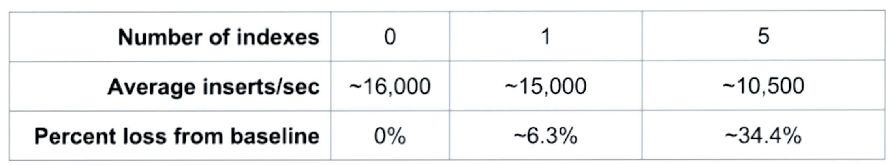

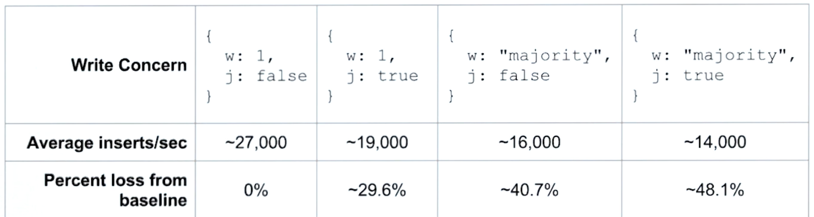

Note: Journaling not much of an effect when requesting majority write concern, but does have greater effect when dealing with only primary.

For `majority` - network latency becomes a factor because waiting on multiple servers.

Also note even though each index added reduced write performance by ~6%, it can improve read performance by more than 10x.

### Data Type Implications

In document store db, data model can be very flexible. Different documents can have the same field contain different data types.

```javascript
db.shapes.insert({
	type: "triangle",
	side_length_type: "equiliateral",
	base: 10,
	height: 20
})
```

Now insert slightly different document into same collection - note `base` field is no longer Integer 64, but now NumberDecimal, no `height` property, but added `side_length` property.

```javascript
db.shapes.insert({
	type: "triangle",
	side_length_type: "isosceles",
	base: NumberDecimal("2.82"),
	side_length: 2
})
```

Here's another variation, all are accepted by Mongo:

```javascript
db.shapes.insert({ type: "square", base: 1 })
db.shapes.insert({ type: "rectangle", base: 1, side: 10 })
```

**Implications for Query Matching**

eg: `db.shapes.find({base: 2.82})`

filter matching field with int or float point val is different than filter matching string or decimal type.

Above find will return no results because there is no document in collection with 2.82 as floating point type, even though there is a NumberDecimal("2.82") in the collection.

Searching for string val of floating point also won't return anything `db.shapes.find({base: "2.82"})`

Expressing query with correct data type will find the matching doc: `db.shapes.find({base: NumberDecimal("2.82")})`.

**Implications for Sorting**

```javascript
db.shapes.find({}, {base:1, _id:0}).sort({base:1})
```

Will compare across all data types for `base` in the `shapes` collection, which up until this point, have all been numeric types (int 64, numeric decimal)

```javascript
{base: 1},
{base: NumberDecimal("2.82")},
{base: 3},
{base: 10},
```

Now insert a string type for `base`:

```javascript
db.shapes.insert( { type: "pyramid", apex: 10, base: "3"} )
db.shapes.insert( { type: "pyramid", apex: 10, base: "14"} )
```

Sorting by `base` again, numeric types sort as before, string types sort at the bottom with `14` appearing before `3`:

```javascript
{base: 1},
{base: NumberDecimal("2.82")},
{base: 3},
{base: 10},
{base: "14"},
{base: "3"},
```

i.e. Mongo groups documents by bson type, then compares for sorting within the groups. Ordering of groups is as follows:

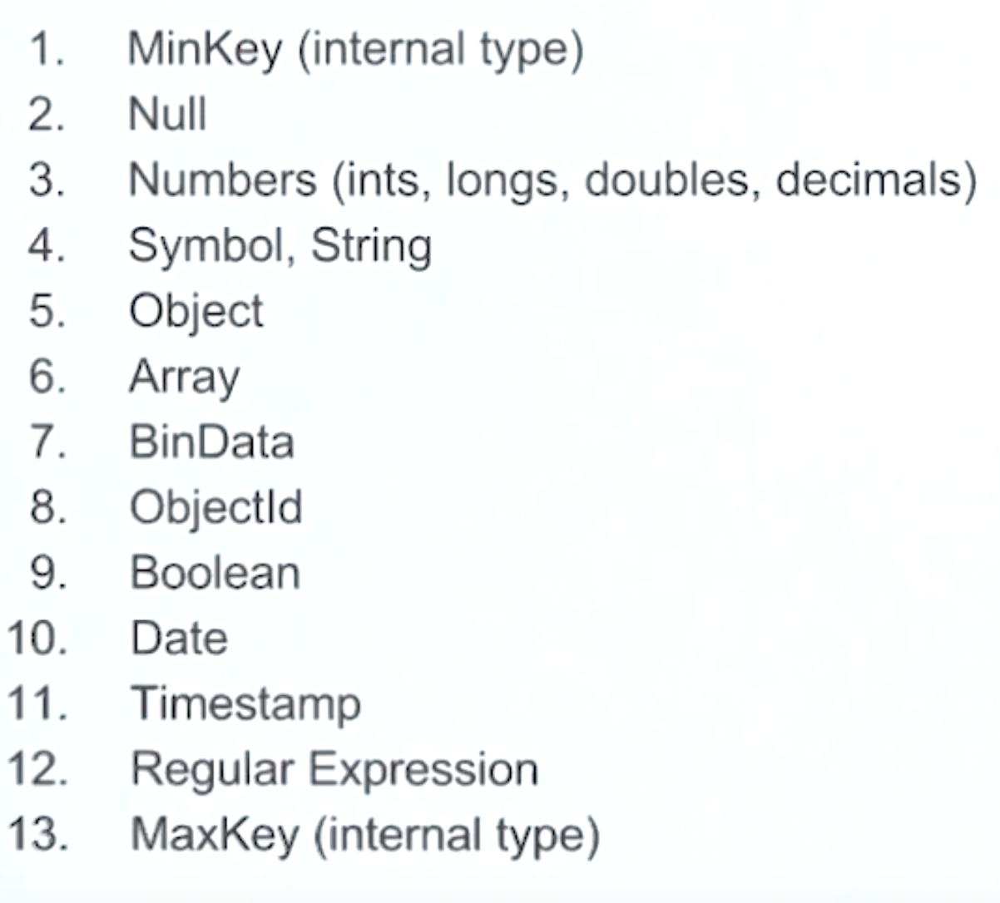

#### Index Structure

Same ordering as discussed in sorting previously applies to index structure. Btree organized by data types within indexed field of documents:


Makes it performant to traverse tree looking for specific data type - can go directly to that branch of the tree.

However, this might not be what app expects, in previous example "14" and "3" were sorted by their string data type rather than numeric values.

This can be solved by an index and collation with `numericOrdering`:

```javascript
db.shapes.createIndex({base: 1}, {collation: {locale: 'en', numericOrdering: true}})
```

Now run sort with applied collation:

```javascript
db.shapes.find({}, {base:1, _id:0}).collation({locale: 'en', numericOrdering: true}).sort({base:1})
```

Still the numeric types will come before the string types, but within string group, will be sorted numerically rather than string ordering:

```javascript
{base: 1},
{base: NumberDecimal("2.82")},
{base: 3},
{base: 10},
{base: "3"},
{base: "14"},
```

**Application Implications**

If populate documents where other docs in collection have multiple different data types for the same field, app needs to handle all those different scenarios. Makes code and tests more complex.

Even though might be useful to do this, use with care!

### Aggregation Performance

Two categories of aggregation queries:

**Realtime processing**

- Provide data for applications
- Query performance is more important

**Batch Processing**

- Provide data for analytics (eg: jobs run on a periodic basis, results not expected until some min/hrs etc later)
- Query performance is less important

This module deals with realtime processing.

#### Index Usage

Want agg queries to use indexes as much as possible, but determining index usage is different.

Agg queries form pipeline of agg operators that transform data into desired format:

```javascript
db.orders.aggregate([
	{ $<operator> : <predicate>},
	{ $<operator> : <predicate>},
	...
])
```

Some agg operators can use indexes and some cannot.

Data moves through pipeline from first to last operator, once server encounters stage that cannot use index, all subsequent stages will no longer be able to use indexes.

Query optimizer does best effort to detect when stage could be moved up to optimize index utilization.

Add explain doc to agg method to understand if queries are being used:

```javascript
db.orders.aggregate([
	{ $<operator> : <predicate>},
	{ $<operator> : <predicate>},
	...
], {explain: true})
```

**Example**

```javascript
db.orders.createIndex({cust_id: 1})
```

`$match` operator is able to use index, especially at beginning of pipeline:

```javascript
db.orders.aggregate([
	{ $match: {cust_id: "287"}},
	...
])
```

$sort stage can also use index, put it as close to front of agg pipeline as possible:

```javascript
db.orders.aggregate([
	{ $match: {cust_id: "287"} },
	{ $sort: {cust_id: 1} }
	...
])
```

If also using `$limit` - make sure its near sort and at front of pipeline. Then server can do `top-k` sort - only needs to allocate memory for final number of documents requested. Same approach can be used even when no indexes are involved. Best performance scenario when limit is used.

```javascript
db.orders.aggregate([
	{ $match: {cust_id: "287"} },
	{ $limit: 10 },
	{ $sort: {total: 1} }
	...
])
```

#### Memory Constraints

- Results are subject to 16MB document limit -> aggs output a single doc, which must be < 16MB. Note limit does not apply to docs as they flow through the pipeline, only to final doc result.
- To mitigate doc limit, use `$limit` and `$project` to reduce resulting doc size.
- 100MB of RAM max available per stage.
- To mitigate stage limit, ensure largest stages are able to use indexes -> reduces memory requirements since indexe entries tend to be smaller than docs they reference. Also using indexes for sorting greatly reduces memory requirements.
- If unable to get mem usage < 100MB, set `allowDiskUse` to have agg spill to disk rather than doing everything in-memory - but use as last resort because hard drive thousands times slower than memory! Tends to be used more in batch processing than real time.
- Note `allowDiskUse` does not work with `$graphLookup`.

```javascript
db.orders.aggregate([...], {allowDiskUse: true})
```

## Performance on Clusters

### Performance Considerations in Distributed Systems

Distributed systems in mongo include Replica Cluster or Shard Cluster (horizontal scalability of data).

Considerations when more than one machine is involved:
- Latency
- Data is spread across different nodes (copies of data or different sets of data in different shards)
- Read implications
- Write implications

**Use Replica Sets in Production!**

Horizontal scaling solution:


High availability is key to guarantee service not affected by system failures. In addition to high availability (if primary goes down, can still use secondary), other beneficts of replica set include:
- offloading eventual consistency data to secondaries, freeing up primary for operational workload?
- having workload configuration where indexes are on secondary nodes?

**Shared cluster**


- Multiple mongos instances responsible for routing client application requests to designated nodes
- Config servvers contain mapping of shard cluster - where data sits, and config of shard cluster
- Shard nodes contain application data (databases, collections, indexes) - major workloads performed here
- Shard nodes are also replica sets

Consider before sharding:
- Have we reached limits of vertical scaling?
- Understand how your data grows and how your data is accessed
- Works by definint key based ranges - shard key
- Important to get a good shard key

**Sources of Latency in a Shard Cluster**

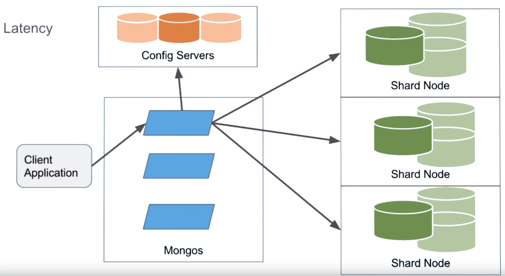

- Client app talks to mongos's.
- Mongos's establish communications with config server to retrieve config info about shard, and with shard nodes to get app-specific data.
- Some latency also caused by replication mechanism within each shard node.

**Architecture to minimize latency**

- Co-locate mongos within same server as client application to minimize number of network hops to access shard nodes.
- Ensure high bandwidth network connection between mongos and shard nodes.

**Types of reads in shard cluster**

- Scatter Gather: Ping all nodes of shard cluster for info corresponding to a given query.
- Routed Queries: Ask a single shard node, or small amount of shard nodes for data requested by application.

Will have different performance profiles:
- Scatter Gather - pay the latency price for asking every single shard node for data
- Routed Query - less latency because only talking to one or few shard nodes

Routed Query is possible when using shard key in queries. If not using shard key, then forced to do Scatter Gather because mongo cannot determine which shard node has data needed to satisfy client query. when shard key is used, mongos knows exactly which shard(s) contain data relevant for this query.

**Sorting in shard cluster**

Involves a few hurdles, but transparent to client application. Mongos routes request to shards containing data. Each shard will perform a sort on its own data locally.

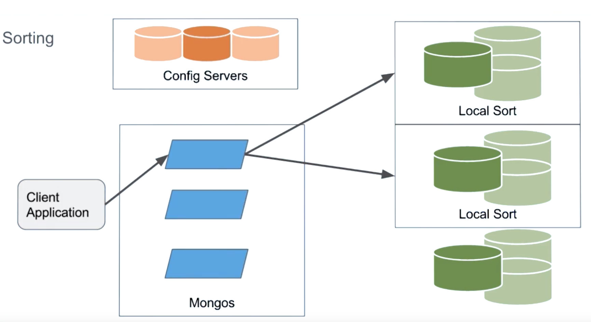

After local sort(s) complete, final sort-merge occurs in primary shard, then data returned to client app.

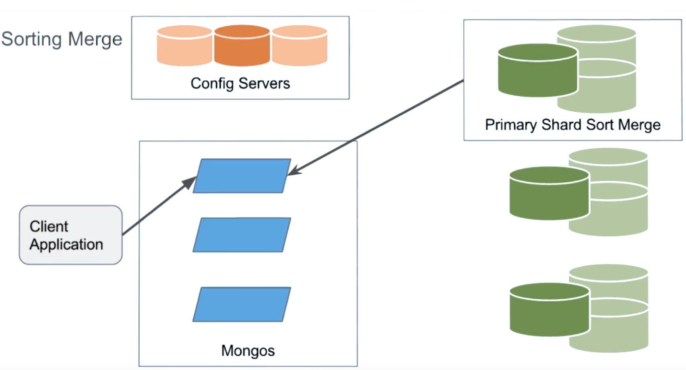

Similar steps needed for limit and skip - local limit/skip performed on each shard that contains portion of the data:

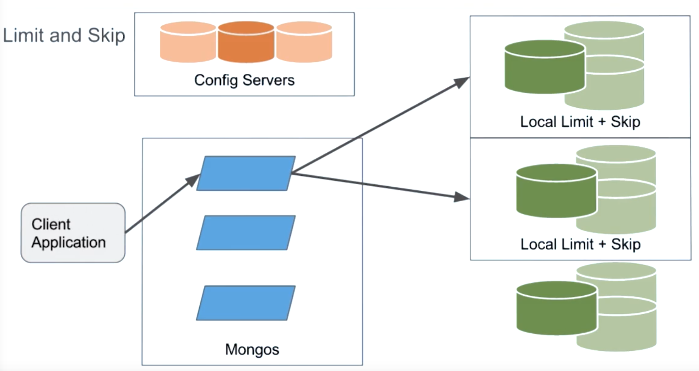

When each shard has completed its local limit/skip, final merge of results is performed on primary shard, then results sent back to client app:

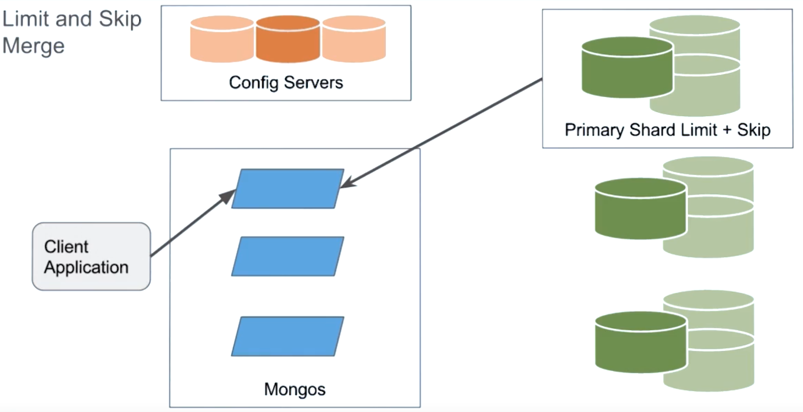

### Increasing Write Performance with Sharding

May have too much data or throughput for single db to handle. Solution is *scaling*.

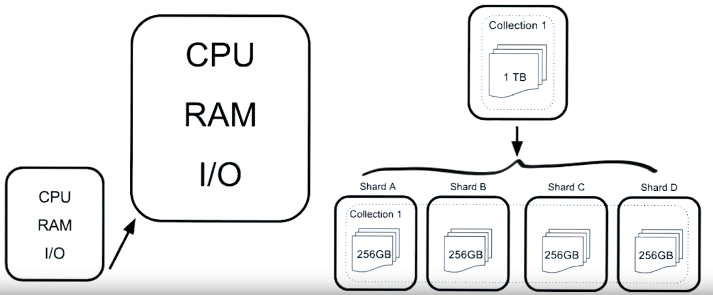

**Vertical**
- Server has too few resources (CPU, RAM, I/O)
- Fix by buying bigger faster machine with more cpu, ram and disk.
- Limit to how much of these resources one physical machine can have.
- Cost is not linear - buying machine that is 2x as fast, more mem, more desk is more than 2x as expensive, could be 4x or more.

**Horizontal**
- Increase total number of servers.
- Split workload between many different machines.
- When reach limit of current setup, add more machines.
- Cost scale linearly with performance requirements because buying more of same machine.

**Shard Cluster**

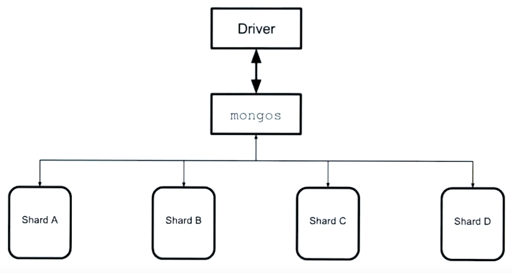

- All reads/writes go via mongos, which must determine which shard to send reads/writes to:
- Achieved with shard key, which defines how data partitioned across different machines.
```javascript
sh.shardCollection('m201.people', {last_name: 1})
```
- Shard key is index field or compound of index fields, must exist in every document in collection.
- Important to have data *evently* distributed across shards, to evently distribute load across machines.

**Shard Key**

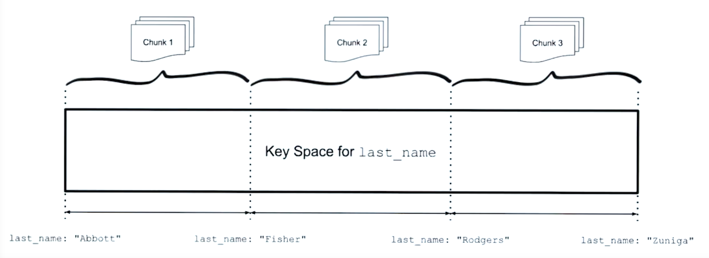

- Using shard key, data divided into small *chunks*.
- Each chunk has inclsuive lower bound and exclusive upper bound.
- Max chunk size is 64M - when chunk reaches close to this size, it gets split.
- Multiple chunks exist on each cluster.

More realistic image:

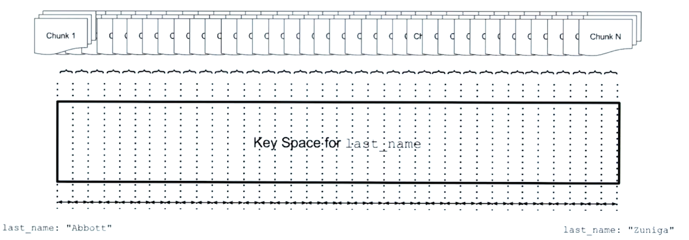

To have write throughput scale linearly with shards, must consider:

***Cardinality***

- Number of distinct values for a given shard key.
- The higher the better.
- Determines max number of chunks that can exist in cluster.

eg: Building an app that will only be used by those living in new york. If shared on `address.state`, would only have one chunk - all of new york would go in there, therefore would only have on shard, which defeats the purpose of sharding:

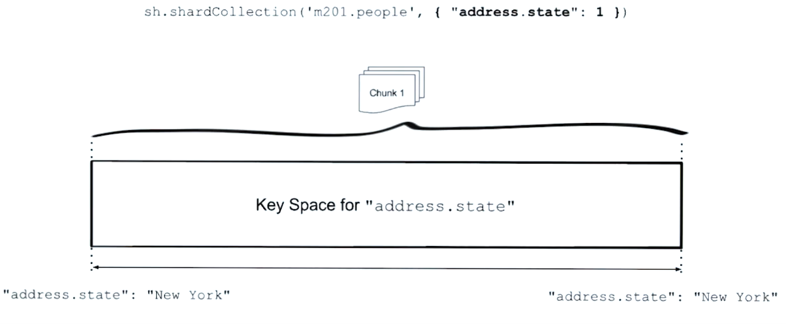

If unable to use a shard key with high cardinality, can increase cardinality with a compound shard key. Eg, rather than range of values only on state, have range of values on combination of state and last name:

```javascript
sh.shardCollection('m201.people', {'address.state': 1, last_name: 1})
```

***Frequency***

- Even distribution of each shard key value is good.
- If some values come in more often than others (eg: common last name like "Brow"), won't have even amount of load across cluster, limiting its effectiveness.

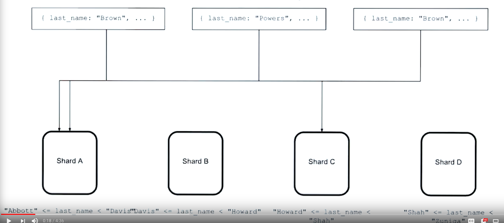

HOT SHARD: If most people using this app have last name "Brown", throughput becomes constrained by shard containing those values (Shard A in above exmaple).

JUMBO CHUNK: Chunks containing frequently occurring values will grow larger. Usually when chunk is close to its max, will be split. BUT if chunk is created where lower and upper bound are the same, this chunk is no longer eligible for splitting:

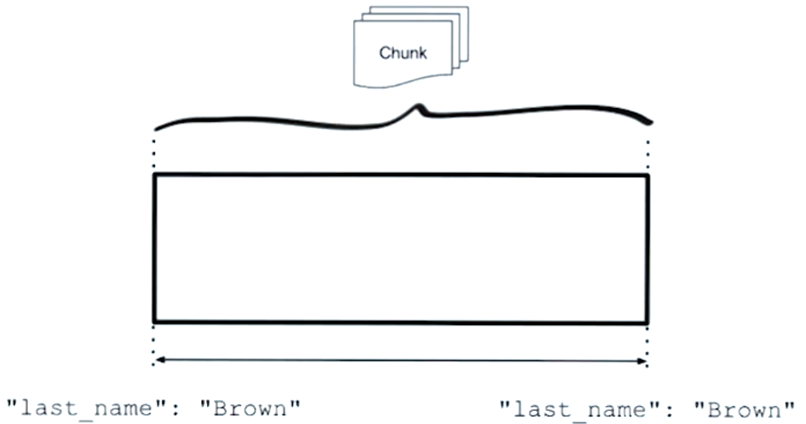

Jumbo chunks reduce effectiveness of horizontal scaling because they cannot be moved between shards.

Frequency issue is mitigated with good compound shard key, in this example:

```javascript
sh.shardCollection('m201.people', {'last_name': 1, _id: 1})
```

Keys at beginning of shard key should have high cardinality, compounding key helps to distribute the frequency of popular values.

***Rate of Change***

- Consider how shard key value changes over time.
- Avoid monotonically (always increasing or always decreasing) increasing or decreasing values. eg - do not shard ObjectId because newer created ObjectId's are always higher in value than previously created values. This will make all writes go to last shard - i.e. shard which contains upper bound of max key:

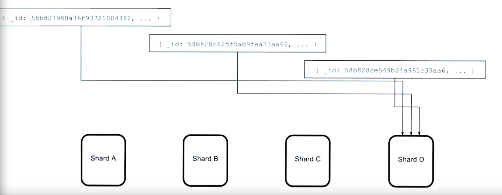

If shard key was monotonically decreasing, all writes would go to first shard - i.e. shard which contains lower bound of min key.

NOTE: It's ok to have monotonically increasing value in compound shard key, as long as it's not in the first field, as per this example. Having monotonically increasing value as second key in compound shard key is good -> increases total cardinality since its guaranteed to be unique.

```javascript
sh.shardCollection('m201.people', {'last_name': 1, _id: 1})
```

**Bulk Writes to Shard Cluster**

Must specify if writes should be ordered or unordered:

```javascript
db.collection.bulkWrite(
	[
		<operation 1>,
		<operation 2>,
		...
	],
	{ordered: <boolean>}
)
```

When `{ordered: true}`, server executes each operation in sequence, waiting for previous operation to succeed before executing next. If any operation fails, process halts and error reported to client:

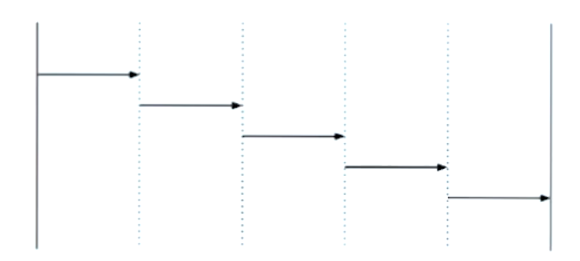

When `{ordered: false}`, server can execute all operations in parallel:

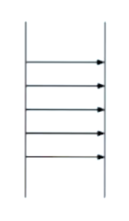

With sharded cluster, ordered bulk writes are performance issue -> have to wait for last operation to complete before next can be executed. With replica set, this won't be so bad because all on one machine. But in sharded cluster, each shard on separate machine so have more latency waiting for each write to succeed:

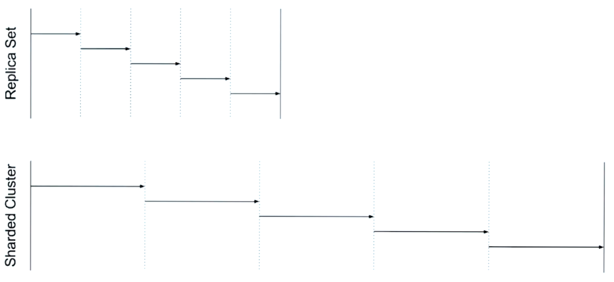

With unordered bulk write on sharded cluster, all operations can be executed in parallel, getting more benefit of distributed nature of shard cluster:

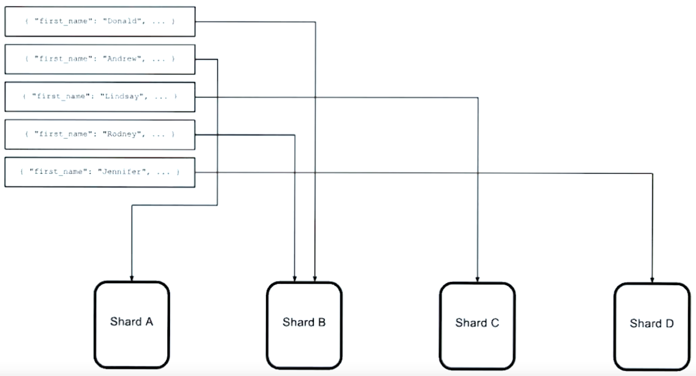

NOTE: Mongos must deserialize the multiple write operations to appropriate nodes.

### Reading from Secondaries

Can specify a read preference, by default, it's `primary` - all reads/writes go to primary server:

```javascript
db.people.find().readPref("primary")
```

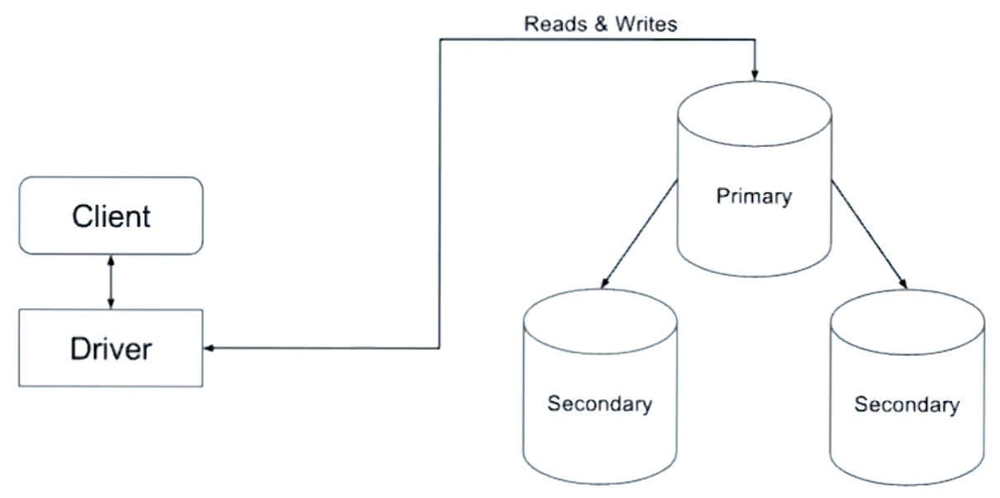

Other readPrefs are:

```javascript
db.people.find().readPref("primary")
db.people.find().readPref("primaryPreferred")
db.people.find().readPref("secondary") 						// relevant to performance
db.people.find().readPref("secondaryPreferred")		// relevant to performance
db.people.find().readPref("nearest")							// relevant to performance
```

If set `readPref("seoncdary")`, all reads routed to secondary:


If set `readPref("seoncdaryPrefered")`, reads will try to go to secondary, but if none available, routed to primary:

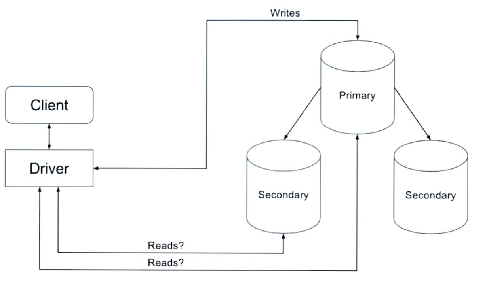

If set `readPref("nearest")`, will read from member that has lowest network latency:

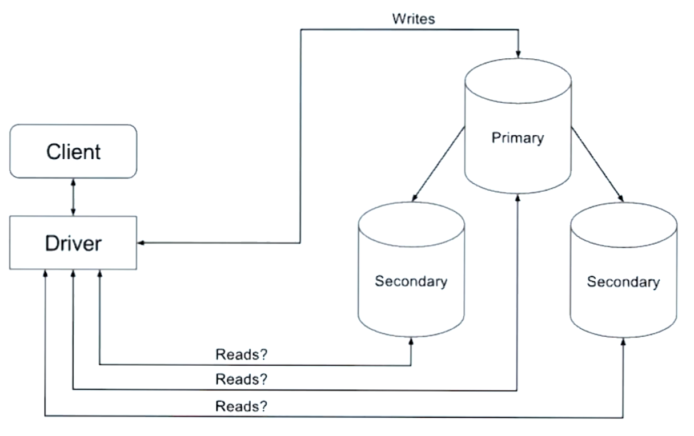

**Eventual Consistency**

When reading from secondary, might be reading stale data! Because data is asynchronously replicated to secondaries as writes occur on primary.

**Strong Consistency**

All writes go to primary, so when reading from primary, guaranteed to be reading latest state of data.

#### When Reading from a Secondary is a GOOD Idea

**Offloading Work**

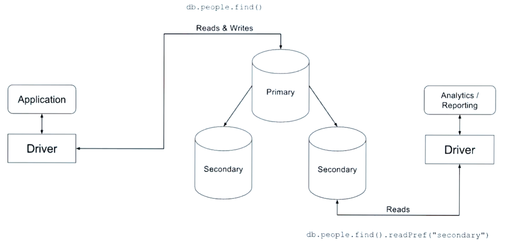

When running analytics/report against data. Tends to be resource intensive and long running. Don't want this running on primary becuase will slow down reads/writes from operational application. Assumption here is that batch report doesn't expect most up-to-date data anyways so some stale-ness is fine.

**Local Reads**

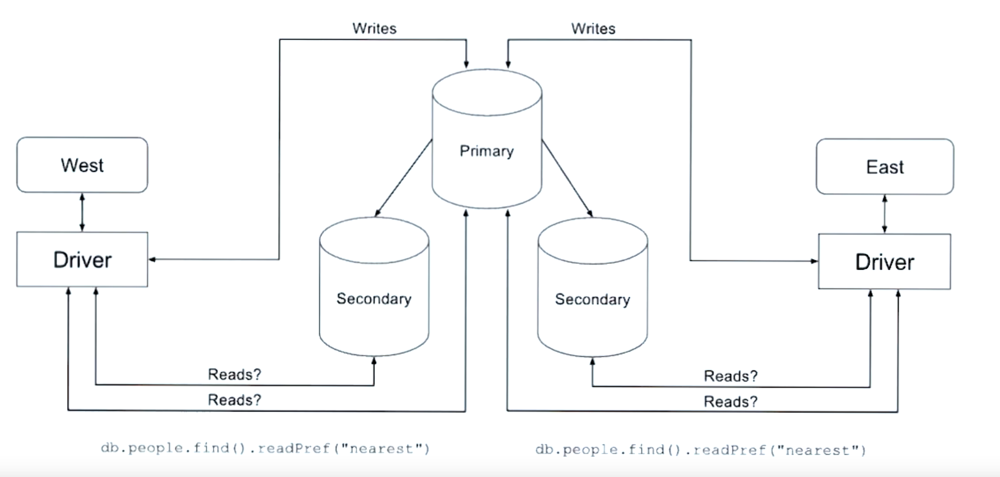

Good for geographically distributed replica sets. eg - have two app servers, one on west coast of US and one on east coast. Have one secondary on west coast and another on east coast.

Use `nearest` in this case to reduce latency, IF clients are ok with reading stale data.

#### When Reading from a Secondary is a BAD Idea

- In general: Secondaries exist to provide high availability, not to increase performance. Sharding increases read/write capacity by distributing read/write operations across a gorup of machines - use this instead of trying to increase performance by reading secondary.
- Providing extra capacity for reads: Misconception that if primary is overworked with writes, can offload some work by reading from secodary -> FALSE because as writes come in to primary, they're replicated to secondaries, so all members of replica set have roughly same amount of write traffic.
- Reading from secondaries in shard cluster -> TERRIBLE! NEVER DO THIS.


Reading from shard secondary may return incomplete or duplicate data due to in progress chunk migrations.